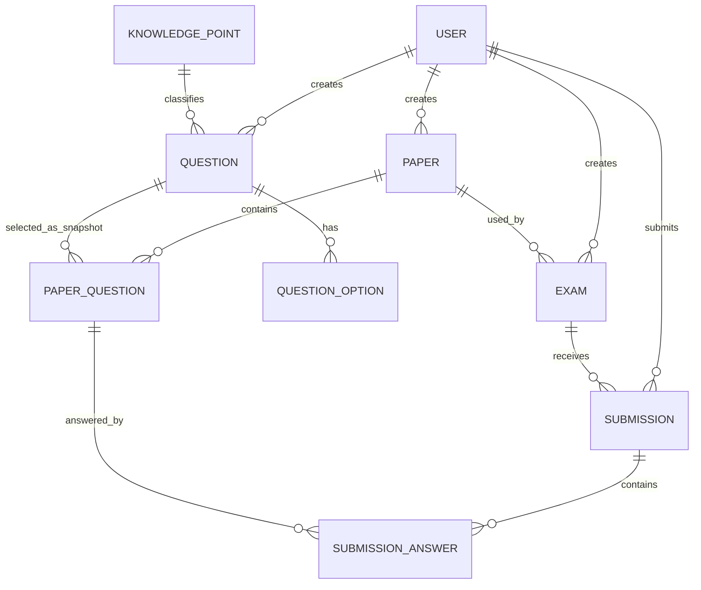

# 数据库设计

## 1. 实体关系

## 2. 设计约束

- 所有业务主键使用无符号 `BIGINT`，由数据库自增生成。
- 分值使用 `DECIMAL(6,1)`，不使用浮点数。
- 题目加入试卷时在 `paper_question` 保存题干、题型、选项和标准答案快照，确保后来修改题库不改变历史试卷。
- `submission(exam_id, student_id)` 唯一，数据库层阻止重复答卷。
- 用户、题目、试卷等历史关联对象采用状态或软删除，不级联物理删除答卷。
- 时间统一按 UTC 写入数据库，API 使用 ISO 8601；展示时由前端转换为本地时区。
- 阅卷相关字段的语义：`submission_answer.graded_at` 非空即表示该题已评分（主观题判 0 分也算已评），`submission.subjective_score` 与 `total_score` 在每次评分后重算，`exam.results_published_at` 非空即表示成绩已公布。判断「是否已评分」不看分数是否为 0。
- JDBC 连接必须设置 `connectionTimeZone=UTC` 与 `forceConnectionTimeZoneToSession=true`，否则由数据库生成的时间（如 `submission.started_at` 的默认值）会按会话本地时区写入、按 UTC 读出，产生时区偏移。答卷开始时间另由后端显式写入，不依赖数据库默认值。

## 3. 迁移策略

结构迁移位于 `backend/src/main/resources/db/migration/`：V1 创建业务表，V2 创建演示账号，V3 为 `question.type` 增加 `PROGRAMMING` 并新增 `question.tags` 关键词列，V4 补充学生乙/丙/丁三个演示账号以支撑同分并列的排名演示。后续变更从 V5 起新增迁移，不修改已执行文件。

测试使用 H2 与 `backend/src/test/resources/schema.sql`，不执行 Flyway；改动迁移脚本时必须同步该文件，并在真实 MySQL 上从空库跑一次迁移。

空数据库验证标准：启动 MySQL 8.4 后运行应用，Flyway 成功创建表和 `flyway_schema_history`，重复启动不重复建表。

当前实测：V1—V4 已在本机 MySQL 9.6 依次应用成功，重复启动提示 `Schema is up to date`。这不等于 8.4 通过（Flyway 11.7 也会提示 9.6 未经测试），MySQL 8.4 空库验证仍是待办项，见 [`test-records.md` 第 5 节](test-records.md#5-未覆盖范围与已知问题)。
