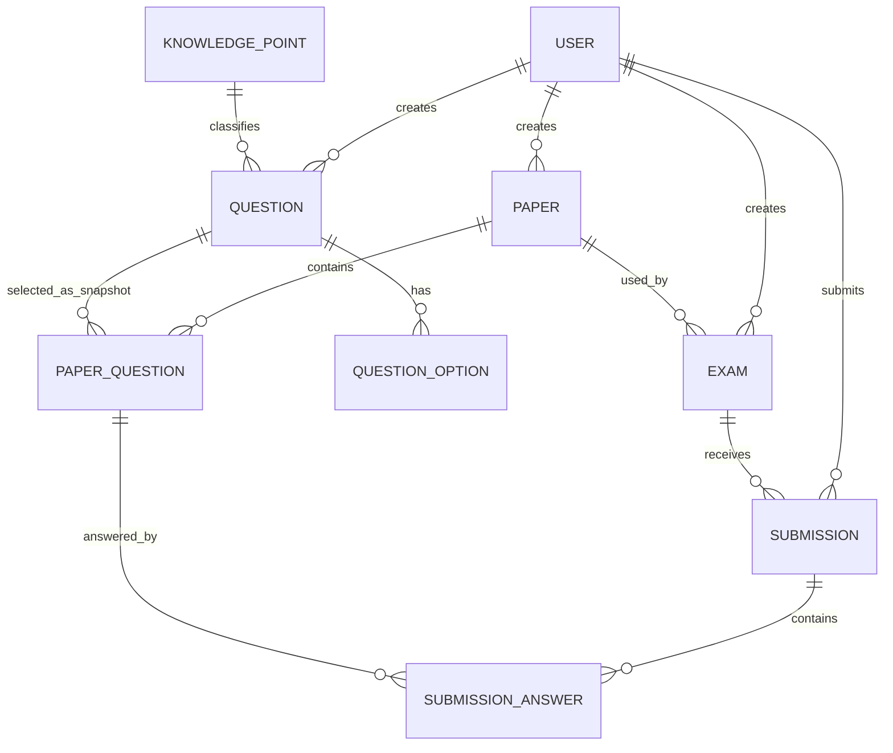

# 数据库设计

## 1. 实体关系

## 2. 设计约束

- 所有业务主键使用无符号 `BIGINT`，由数据库自增生成。
- 分值使用 `DECIMAL(6,1)`，不使用浮点数。
- 题目加入试卷时在 `paper_question` 保存题干、题型、选项和标准答案快照，确保后来修改题库不改变历史试卷。
- `submission(exam_id, student_id)` 唯一，数据库层阻止重复答卷。
- 用户、题目、试卷等历史关联对象采用状态或软删除，不级联物理删除答卷。
- 时间统一按 UTC 写入数据库，API 使用 ISO 8601；展示时由前端转换为本地时区。

## 3. 迁移策略

结构迁移位于 `backend/src/main/resources/db/migration/`：V1 创建业务表，V2 创建演示账号。后续变更从 V3 起新增迁移，不修改已执行文件。

空数据库验证标准：启动 MySQL 8.4 后运行应用，Flyway 成功创建表和 `flyway_schema_history`，重复启动不重复建表。
