# 智能在线题库与组卷系统 · 项目报告

| 项 | 内容 |
|---|---|
| 课程 | 软件开发实践 2（2025~2026~2 短学期，指导教师：杨艳） |
| 选题 | 在线题库与组卷系统 |
| 技术路线 | 基于 Java 的 Web 应用程序设计，前后端分离 |
| 完成人 | 1 人独立完成（姓名 / 学号：**请填写**） |
| 报告日期 | 2026-09-04 |
| 代码仓库 | 本仓库，默认分支 `main` |

> **一句话介绍**：教师维护题库并组卷（手动或按规则自动抽题），发布考试后学生在线答题，系统自动判客观题、教师批阅主观题，确认公布后学生查看本人成绩、名次与完整答卷，并可从错题本重练错题；另提供 AI 辅助出题、题库批量导入与试卷导出、统计分析和可由管理员在线调整的运行参数。

本报告按课程要求的五节组织：项目背景、需求分析、设计文档、系统演示、心得体会，并补充「运行结果分析」与「已知边界」两节，对应评价要点中的「对程序运行结果的分析」和「项目实施思考」。报告中的每一个数字都能在仓库里复核，复核命令见附录。

---

## 1. 项目背景

### 1.1 问题与目标

高校课程的平时测验长期依赖「Word 出卷 → 打印 → 纸质作答 → 人工批改 → 手工登分」这条链路。它的成本几乎全部落在教师身上：同一道题在不同学期被反复重打，客观题的批改是纯机械劳动，成绩统计要再手工汇总一遍，而学生除了一个总分之外拿不到任何反馈——不知道错在哪、更不知道自己在班级中的位置。

本项目的目标不是做一个功能大而全的教学平台，而是把上述链路中**最费人力且最容易出错的一段**完整跑通：

> 教师维护题库 → 创建并发布试卷 → 学生在线答题 → 系统自动判客观题 → 教师批阅主观题 → 确认公布并查看成绩

围绕这条主线，确定了三条不可妥协的约束，它们同时也是本项目区别于「能跑就行的课程作业」的地方：

1. **成绩必须可追溯。** 教师随时会修改题库，但已经算出的分数不能因此改变。
2. **权限必须在服务端。** 前端隐藏按钮不构成任何保护，成绩公布前不能把答案下发到浏览器。
3. **判分必须确定。** 同一份答卷无论交多少次、由谁触发、走正常交卷还是超时兜底，结果必须一致。

### 1.2 竞品分析

选题前核对了三款真实产品的公开文档，只记录**官方页面可复核的能力**，不把竞品的宣传数据当作本项目的性能依据。页面核对时间为 2026-09-01。

| 产品 | 官方资料显示的相关能力 | 本项目借鉴 | 本期不照搬的部分 |
|---|---|---|---|
| **Moodle Quiz** | 题目独立存放在题库中，可分类、筛选、跨测验复用；测验支持预览、提交、成绩查看与教师查看作答 | 题库与试卷彻底分离；按知识点/难度筛选；发布前必须预览；历史题目只停用不删除 | 跨课程共享题库、复杂题型与插件体系 |
| **Canvas New Quizzes** | 可从 Item Banks 向测验添加单题或多题，并在测验内单独设置每题分值 | 从题库手动选题组卷；试卷中的题目拥有独立于题库「建议分值」的实际分值 | LMS 课程体系、机构级题库共享、QTI 导入导出 |
| **Google Forms Quiz** | 可配置答案与分值、对部分题型自动评分、逐份或逐题人工评分，并可选择立即公布或人工复核后公布成绩 | 客观题自动判分 + 主观题人工评分的混合模型；成绩必须教师确认后才公布 | 通用表单能力、邮件发分、表格生态集成 |

官方资料：

- [Moodle Question banks](https://docs.moodle.org/500/en/Question_banks)、[Moodle Quiz activity](https://docs.moodle.org/401/en/Quiz_activity)
- [Canvas：如何在新测验中将题库中的题目添加到测验中](https://community.canvaslms.com/t5/%E6%8C%87%E5%8D%97%E4%B8%AD%E6%96%87%E7%89%88-%E8%AE%B2%E5%B8%88%E6%8C%87%E5%8D%97-instructor/%E6%88%91%E8%AF%A5%E5%A6%82%E4%BD%95%E5%9C%A8%E6%96%B0%E6%B5%8B%E9%AA%8C%E4%B8%AD%E5%B0%86%E9%A2%98%E5%BA%93%E4%B8%AD%E7%9A%84%E9%A2%98%E7%9B%AE%E6%B7%BB%E5%8A%A0%E5%88%B0%E6%B5%8B%E9%AA%8C%E4%B8%AD/ta-p/571537)
- [Google Forms：创建和批改测验](https://support.google.com/docs/answer/7032287?hl=zh-Hans)

**三款竞品共同印证的一个设计判断**：题库与试卷必须是两个独立实体。它们都没有把题目直接写在卷子里，因为一旦如此，题目就无法复用、也无法在不影响历史卷子的前提下修订。本项目在此基础上更进一步——组卷时把题干、选项、标准答案和解析**快照**写入试卷，这样连「修订题目会不会影响已算出的分数」这个问题都从根上消除了（见 3.6 决策 1）。

### 1.3 组内分工

课程要求 2—4 人/组，**本项目实际由 1 人独立完成**，不虚构团队成员。按角色拆分，同一人在不同阶段承担了以下工作：

| 角色 | 工作内容 | 工时占比 |
|---|---:|---:|
| 需求与设计 | 需求分析、原型说明、API 契约、ER 设计、分阶段计划 | 约 20% |
| 后端开发 | 认证鉴权、题库、组卷（手动 + 规则自动）、考试、答题、判分、阅卷、成绩、统计、错题本与重练、AI 适配层、批量导入解析与试卷导出、可编辑设置 | 约 35% |
| 前端开发 | 登录、题库、组卷、考试、答题、阅卷、成绩、统计、错题本、系统设置十个页面与接口客户端 | 约 25% |
| 数据与测试 | Flyway 迁移、演示数据、后端 55 项与前端 55 项自动化测试、浏览器走查 | 约 15% |
| 文档与演示 | 需求/设计/API/数据库/测试记录/演示脚本/本报告 | 约 5% |

**单人开发如何替代第二人复核**——这是评价要点里「分工合理性」在单人项目下真正需要回答的问题。本项目用四层可复核证据代替了不存在的同伴评审：

1. **把验收数字写死进测试断言**（客观题 20 分、总分 28 分、名次 `1、2、2、4`、及格率 25.0%）。任何改动一旦动了判分逻辑，测试立刻变红，不依赖人记得去检查。
2. **逐日开发记录**（[`log.md`](../log.md)）留下每次改动的内容、验证方式和下一步，可与 Git 历史逐条对照。
3. **浏览器完整走查并留存 39 张截图**，界面行为与接口响应互相印证。走查本身就抓出了 11 个自动化测试全绿却会出现在验收现场的界面缺陷。
4. **在真实 MySQL 上复现全部验收数字**，而不是只跑内存数据库里的测试。

---

## 2. 需求分析

### 2.1 角色与目标

| 角色 | 核心目标 | 本期操作 |
|---|---|---|
| 管理员 | 保证账号可用，不建设复杂运营后台 | 分页查询用户、新增用户、启用/停用 |
| 教师 | 完成从建题到公布成绩的完整教学流程 | 维护知识点与题目、组卷、发布考试、阅卷、公布成绩、查看统计 |
| 学生 | 完成考试并了解自己的表现 | 查看可参加考试、答题、交卷、查看本人成绩/名次/答卷 |

MVP 不建设班级与选课模块：状态正常的学生均可参加开放时间内已发布的考试。这是一个有意识的范围裁剪——班级模型会引入「学生—班级—课程—考试」四层关联，而它对验证本项目的核心闭环没有贡献。

### 2.2 功能需求

| 模块 | 功能 | 可验收结果 |
|---|---|---|
| 认证与权限 | 登录、退出、三类角色鉴权、账号状态校验 | 未登录 401，越权 403，停用账号旧令牌立即失效 |
| 用户管理 | 管理员查询、新增、启用/停用 | 停用立即生效，历史数据保留，不能停用自己 |
| 题库 | 五类题型（单选/多选/判断/简答/编程）+ 知识点 + 关键词标签 | 按题型、难度、知识点、状态、关键词「与」关系联合筛选 |
| 试卷 | 手动选题、逐题分值、题序调整、草稿、预览、发布 | 分值合计与总分不一致时拒绝发布 |
| 考试 | 开放时间与时长、答题、倒计时、主动/超时交卷 | 一名学生对一场考试只有一份有效答卷 |
| 评分 | 客观题自动判分、简答题教师评分、总分汇总 | 示例答卷客观 20 + 主观 8 = 总分 28 |
| 成绩 | 教师查看答卷/统计/排名，确认公布后学生查看本人数据 | 公布前不下发分数与答案；学生不能访问他人答卷 |
| AI 辅助出题 | 兼容 OpenAI 与 Anthropic 协议，只生成草稿 | 未配置或调用失败不影响手工出题 |
| 题库批量导入 | CSV/TSV 表格，先预览逐行结果再确认写库 | 预览不写库且预览数=实际写入数；导入走与手工出题相同的校验 |
| 规则自动组卷 | 按「题型/难度/知识点 + 抽几道 + 每道几分」抽题生成方案 | 只生成方案不写库，保存仍走原组卷接口；题目不够时报错而不是少抽 |
| 试卷导出 | Markdown（可打印，含/不含答案）与 CSV（可回导题库） | 不含答案的版本里没有任何答案；导出的 CSV 能被导入接口原样读回 |
| 错题本与错题重练 | 收录已公布成绩考试里未得满分的题目，客观题可重练 | 成绩公布前错题本为空；练习集不下发答案；重练不改动任何成绩 |
| 统计分析 | 题库分布、成绩分布、逐题正确率与得分率 | 统计口径与成绩页完全一致 |
| 系统设置 | 六项白名单参数由管理员在线修改 | 改及格线后成绩页与统计页的及格率立即重算，无需重启；密钥不可编辑 |

**明确排除**：在线监考、AI 主观题评分、支付、第三方教务集成。排除项写进文档而不是留作「以后再说」，是为了让验收时的功能边界没有歧义。（原先一并排除的规则自动组卷、错题本与试卷导出已于 2026-09-04 追加确认并实现，因此从排除项移入上表。）

### 2.3 核心业务流程

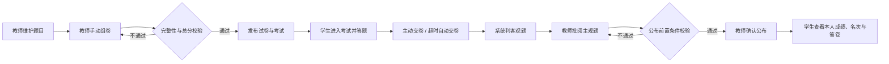

考试状态按 `草稿 → 已发布 → 已公布成绩` 流转（数据库另预留 `进行中`、`已结束`、`已完成阅卷` 三态）。公布成绩有三个前置条件，缺任何一条都会被拒绝：至少一份答卷、无人仍在作答、全场主观题已批完。

### 2.4 非功能要求与边界

- **安全**：密码使用 BCrypt（自带随机盐）；JWT 采用 HS256、有效期 60 分钟；密钥与数据库口令只来自环境变量，不进仓库。
- **一致性**：分值全程使用 `DECIMAL(6,1)` 与 `BigDecimal`，不使用浮点数；交卷与判分在同一事务内完成。
- **时间**：数据库连接强制 `connectionTimeZone=UTC`，API 使用 ISO 8601，展示由前端转本地时区。
- **可维护性**：结构变更一律通过 Flyway 版本化迁移，不手工改表。
- **未做性能测试**：`plan.md` 中「1000 题、20 并发、95% 响应 < 1 秒」的指标**没有实测数据**，因此本报告不声称达标。

### 2.5 验收数据

固定一组数据，使文档、测试断言、演示脚本与截图能互相印证：

- 账号：`admin`、`teacher`、`student`（学生甲）、`student2/3/4`（乙/丙/丁），密码统一 `ExamDemo123!`。
- 主线试卷：单选 + 多选 + 判断 + 简答各一题，每题 10 分，总分 40 分，时长 30 分钟。
- 学生甲作答：单选正确、多选**只选一项（少选）**、判断正确、简答作答；教师给简答评 8 分。
- 预期结果：客观题 **20** 分、主观题 **8** 分、总分 **28** 分。
- 排名试卷：2 道客观题共 20 分，四名学生得 20/10/10/0 → 名次 **`1、2、2、4`**，平均分 10.0，及格率 25.0%。

---

## 3. 设计文档

### 3.1 技术选型与理由

| 层次 | 选型 | 为什么选它 |
|---|---|---|
| 前端 | Vue 3.5 + TypeScript + Vite 8 | 课程指定前后端分离与 Vue；TypeScript 让接口契约在编译期对齐，改后端字段时前端立刻报错 |
| 状态管理 | 模块级 `ref`（**未引入 Pinia**） | 需要跨组件共享的状态只有「令牌」和「当前用户」两项，为此引入一整套状态库不划算 |
| 路由 | 一个 `active` 字符串（**未引入 vue-router**） | 本期只有单层页面切换，无嵌套路由与 URL 分享需求；少一个依赖也少一处需要解释的复杂度 |
| 图表 | CSS 条形图自绘（**未引入 ECharts**） | 需要的只是「按最大值等比缩放的一条横杠」，为此加几百 KB 依赖不划算 |
| 后端 | Spring Boot 3.5.16 + Spring Security | 课程指定 Spring Boot；Security 提供成熟的 JWT 资源服务器与方法级鉴权 |
| 持久层 | Spring JDBC `JdbcClient`（**未用 JPA**） | SQL 全部显式可见，便于逐条解释每个查询做了什么，也避免 N+1 之类隐式行为 |
| 数据库 | MySQL 8.4 LTS + Flyway 11 | 课程指定；Flyway 让结构变更版本化，可从空库重建 |
| 鉴权 | 无状态 JWT（HS256，60 分钟） | 前后端分离下不需要服务端会话；代价是无法吊销，用「每次请求回查用户状态」补上停用即时生效 |

**运行时依赖只有 Vue 一个**——这是刻意维持的结果。上面四处「未引入」用的是同一条标准：一个依赖必须解决一个本项目真实遇到的问题，且答辩时能解释清楚为什么需要它。前端生产构建产物 193.96 KB（gzip 62.15 KB）。

### 3.2 系统架构

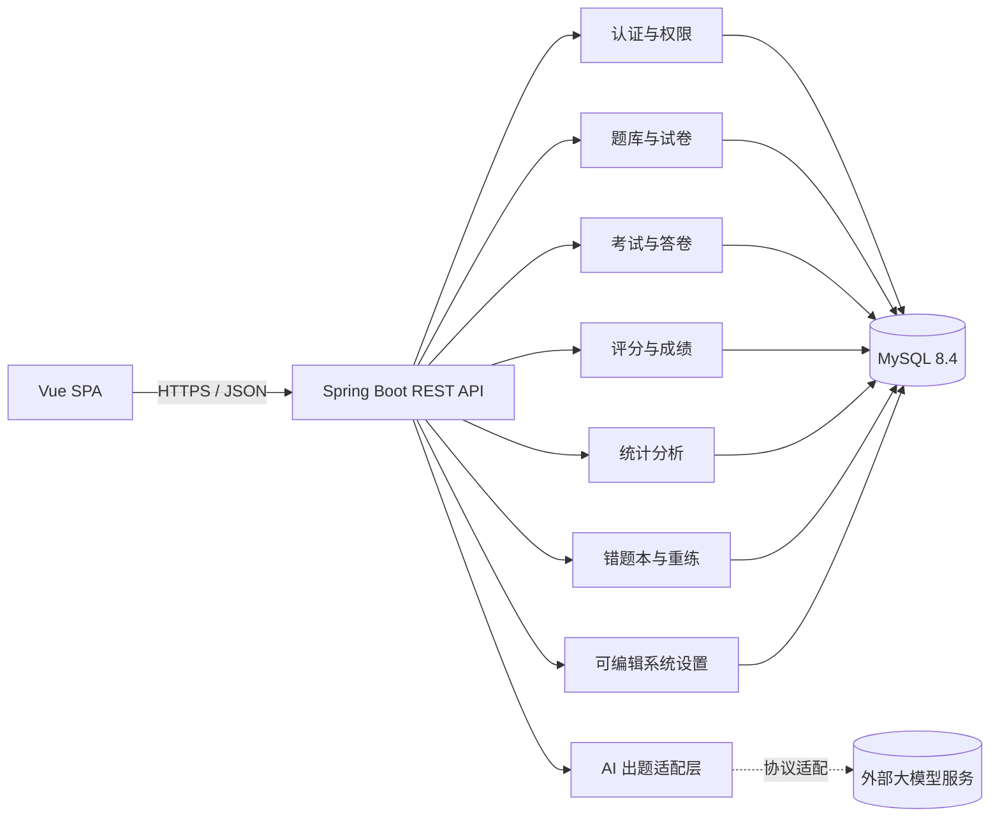

分层职责：Controller 只做 HTTP 映射、参数校验与响应转换；Service 承担权限后的业务规则与事务边界；Repository 只负责持久化访问；数据库唯一约束是防重复提交的最终保障。API 不暴露数据库实体，全部使用请求/响应 DTO。

后端按 `auth`、`user`、`question`、`exam`、`practice`、`ai`、`stats`、`system`、`common` 九个模块组织，共 60 个 Java 文件。其中五处模块边界值得单独说明：

- **`ai` 不直连数据库。** 它把模型输出组装成题目请求后交给 `QuestionService` 校验，保存仍走普通的题目新增接口——AI 没有任何绕过业务校验的通道。
- **批量导入与 `ai` 共用同一段答案归一化。** `AnswerNormalizer` 抽在 `question` 模块里，被 AI 出题和批量导入同时使用：两者面对的是同一类问题（拿到的是人或模型随手写的形态，如 `"AB"`、「正确」），各写一份迟早会出现「AI 能识别的写法导入不认」这种莫名其妙的差异。归一化只改形态、不改内容，正确性一律回到 `validateDraft`。
- **`stats` 是只读上层模块。** 单场考试的平均分、最高分、及格率和排名**直接调用 `GradingService#results`**，因此「谁能看这场考试」的归属校验与成绩口径都只有一处实现，成绩管理页与统计分析页在数学上不可能对不上。
- **`practice`（错题本与重练）同样只读上层 + 一张独立表。** 错题的定义（本人、已公布成绩、未得满分）只写一次，三个查询共用；判分复用从 `ExamService` 抽出的 `ObjectiveGrader`，与交卷判分是同一份实现——否则「考试判错、重练判对」这种分歧无法向学生解释。练习记录写在独立的 `practice_attempt` 表，不碰答卷。
- **设置的存取放在 `common` 而不是 `system`。** 及格线、导入上限这些参数的使用方分散在 `exam`、`question`、`practice`、`auth` 四个模块，把 `SettingsStore` 与 `SettingsCatalog` 放进 `common`（与 `DomainException`、`PageResult` 同级的横切设施），各业务模块就只依赖 `common`，不必反向依赖 `system`——`system` 模块只保留那个 Controller。

试卷侧的两个新能力也没有新增写入路径：`PaperAutoComposeService` 只读题库并返回方案，保存仍走 `ExamService#createPaper`；`PaperExportService` 只读试卷快照并生成文本。**加上题库的三条入口共用一套校验，本系统里每一种业务对象都只有一条写入路径。**

### 3.3 原型设计

原型见 [`docs/images/界面原型设计.png`](images/界面原型设计.png) 与 [`docs/prototype.md`](prototype.md)。四个关键页面（登录、题库、组卷、学生答题）按原型实现，实际界面见第 4 节截图。

信息架构上有一处刻意的差异：**学生使用整页答题界面，没有侧栏**。教师和管理员是「在多个功能间切换」的使用模式，需要侧栏导航；学生在考试期间只需要做一件事，任何额外的导航入口都是干扰。

### 3.4 API 设计

统一响应结构，成功与失败使用同一层信封，便于前端集中处理：

```jsonc
// 成功
{ "data": { /* 业务数据 */ }, "requestId": "5f16f2eb-..." }
// 失败
{ "code": "PAPER_SCORE_MISMATCH", "message": "题目分值合计与总分不一致",
  "fieldErrors": {}, "requestId": "5f16f2eb-..." }
```

共 **47 个 REST 端点**，清单见 [`docs/api.md`](api.md)。设计约定中三条最关键的：

1. **业务错误码是稳定契约**，前端按 `code` 分支而不是匹配 `message` 文案。
2. **状态跃迁类操作不幂等**：重复交卷返回 `409 SUBMISSION_ALREADY_SUBMITTED`，重复公布返回 `409 INVALID_STATE_TRANSITION`，让客户端明确知道自己的状态已经过期，需要刷新。
3. **同一个响应结构服务三个场景**（教师阅卷、学生答题回看、学生查分），由后端按「谁在看 + 是否已公布」裁剪字段。

### 3.5 数据库设计

11 张业务表，Flyway 迁移 V1—V5。

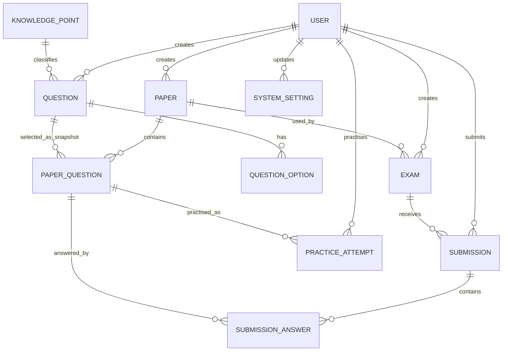

关键约束：

- `paper_question` 保存题干、题型、选项、标准答案、解析五项**快照**，这是成绩可追溯性的物理基础。
- `submission(exam_id, student_id)` 唯一约束——先查后插之间存在竞态，只有数据库约束能真正保证一人一份。
- `submission_answer.graded_at` 非空即表示该题已评分（主观题判 0 分也算已评），判断「是否已评」不看分数是否为 0。
- 用户、题目等历史关联对象采用状态标记或软删除，不级联物理删除答卷。
- `practice_attempt`（错题重练记录）指向 `paper_question` 而不是 `question`：错题来自某次考试的具体一道题，题库里的原题之后可能被编辑，重练的必须仍是当时那一道快照。这张表**与答卷完全隔离**——重练不改动 `submission` 与 `submission_answer` 的任何字段。
- `system_setting` 只保存被改过的项：环境变量是默认值，本表是覆盖层，因此「恢复默认」实现为删除该行，而不是写回一个当时的默认值。可覆盖的键由后端白名单固定，数据库连接、JWT 与 AI 密钥一律不进本表。

### 3.6 关键设计决策

每条都是「问题 → 做法 → 为什么不用另一种」，也是答辩问答的主要素材。

| # | 问题 | 做法 | 为什么 |
|---|---|---|---|
| 1 | 教师改了题库，历史成绩会不会变 | 组卷时把题干、选项、标准答案、解析快照写入 `paper_question` | 不快照的话，改一道题的答案会让已算出的分数失去依据 |
| 2 | 学生连点两次「交卷」会不会重复计分 | 交卷与判分在同一事务内，**先 `SELECT ... FOR UPDATE` 取行锁再读状态** | 顺序不能颠倒：先读后锁会让两个并发请求都读到「作答中」然后都去判分 |
| 3 | 一人一场怎么保证只有一份答卷 | 唯一约束 + 捕获约束冲突转 409 | 应用层「先查后插」之间存在竞态窗口 |
| 4 | 学生关掉浏览器，卷子怎么办 | 服务端每 30 秒扫描已过截止时间仍在作答的答卷，事务内自动交卷并判分 | 靠前端倒计时触发的话，关掉页面的答卷会永远停在「作答中」，教师也就永远无法完成阅卷 |
| 5 | 超时自动交卷判的是什么 | 答案在切题时和每 30 秒各同步一次到服务端 | 早期版本只在点交卷时提交答案，超时未交的学生被判 0 分——这是实际踩过的缺陷 |
| 6 | 刷新页面后答案从哪里恢复 | **服务端已保存答案优先**，本地草稿只补服务端没有的题目 | 反过来会让过期草稿覆盖服务端答案，下一次同步就把旧答案写回去，造成真正的数据丢失 |
| 7 | 成绩公布前学生能看到什么 | 后端按「谁在看 + 是否已公布」裁剪字段，公布前分数、答案、解析、评语、名次一律 `null` | 前端不显示不等于没下发，浏览器里能看到的就等于已经泄露 |
| 8 | `0` 分和「不给你看」怎么区分 | 分数类字段用可空类型，`null` 表示不可见，`0` 表示真的 0 分 | 混在一起会让学生以为自己被判了 0 分 |
| 9 | 「已评分」怎么判断 | 看 `graded_at` 是否为空，不看分数是否为 0 | 教师完全可以给主观题打 0 分，那也是已评分 |
| 10 | 同分怎么排名 | 竞赛排名，同分并列且占用名次（`1、2、2、4`）；在 Java 中计算而不用窗口函数 | Java 实现更直观也更易测；入选条件是「已交卷且无未评主观题」，全客观题的卷子交完即进排名 |
| 11 | 题目被引用了还能删吗 | 已被试卷引用的题目，删除时降级为停用 | 物理删除会破坏历史试卷快照和成绩归属 |
| 12 | 账号停用后旧令牌还能用吗 | 每次鉴权都回查一次用户表，账号不存在或已停用即 401 | JWT 无法吊销；多这一次查询换来「停用真正生效」 |
| 13 | 换 AI 服务商要改代码吗 | 协议、地址、模型、密钥都是环境变量；适配层只做「拼请求、取文本」两件事 | 只改四个变量就能在 DeepSeek / 通义 / Kimi / 本地 Ollama / Anthropic 之间切换 |
| 14 | AI 会不会写出不合规的题 | 题型、难度、知识点、分值由教师指定；模型输出先归一化形态再走与手工出题**完全相同**的校验；不合规的丢弃并说明原因 | AI 只生成草稿，保存走普通的 `POST /questions`，不存在绕过校验的通道 |
| 15 | 时间为什么会差 8 小时 | 连接串强制 `connectionTimeZone=UTC&forceConnectionTimeZoneToSession=true`，答卷开始时间由后端显式写入 | 由数据库生成的默认时间会按会话本地时区写入、按 UTC 读出，产生固定偏移——这是实际踩过的缺陷 |
| 16 | 统计页的平均分会不会和成绩页不一致 | 统计分析**直接调用成绩接口的同一个实现**，只自己算分布与逐题聚合 | 同一个数字有两处实现早晚会对不上；归属校验也随之复用 |
| 17 | 主观题的正确率显示什么 | 显示 `—`，用 `null` 表示「不适用」，改看得分率 | 主观题没有对错。一道刚评了 8 分的简答题若显示「正确率 0%」是直接的误导 |
| 18 | 系统设置哪些能改、哪些不能 | 只有白名单里「每次用到都会重新读」的六项可改（见决策 33），其余只读展示当前**进程真正生效**的值 | 对启动时固化的参数做可编辑表单，就会造成「界面改完但进程没重启」的显示与生效不一致 |
| 19 | 界面为什么要按角色请求接口 | 首页按角色分别取数：教师取题库与考试，管理员取账号构成 | 早期版本对两种角色都请求教师接口，管理员一登录就收到四个 403 并看到一条对他毫无意义的报错 |
| 20 | 批量导入会不会绕过题目校验 | 导入逐行构造与手工出题**完全相同**的请求对象，调同一个 `QuestionService.validateDraft` 与 `create` | 题库现在有三条入口（手工、AI 草稿、批量导入）。若导入自带一套宽松校验，一道「标准答案指向不存在选项」的题会静静躺在题库里，直到某场考试给全班判 0 分 |
| 21 | 导入写库前怎么让教师看清楚 | 接口的 `dryRun` **缺省为 true**，预览与导入是同一段代码，只差最后一步写不写库 | 批量操作出错没法一键撤销，漏传参数的后果应该是「什么都没发生」；共用一段代码才能保证「预览说能导入几道，实际就是几道」 |
| 22 | 导入到第 7 行失败，前 6 行要不要回滚 | 导入服务**刻意不加事务**，每行由 `create` 各自开事务，逐行独立成败 | 50 道题里错 3 道，教师只需改这 3 道；整批回滚会让他为一格笔误重传整个文件 |
| 23 | 表格里的知识点不存在怎么办 | 报错点名说明缺哪个知识点，**不自动创建** | 知识点名称全局唯一且是题库的分类骨架，表格里一个错别字会留下「Java基础」和「Java 基楚」这样一对永久的孪生分类 |
| 24 | 为什么不引入 CSV 解析库 | 自写约 90 行状态机：剥 BOM、探测分隔符、处理引号内的逗号与换行、记录原文行号 | 需要的只是「带引号转义的分隔文本 + 表头列名映射」；但必须自己实现的部分一个都不能省——题干里出现逗号几乎是必然的，按 `split(",")` 处理会把一道题拆成两列 |
| 25 | 自动组卷要不要直接把试卷存下来 | **只生成方案，不写库**：抽中的题目返回给前端填进组卷页，保存仍走 `POST /papers` | 分值合计、题目归属与启用状态的校验只有一处实现。而且抽题是随机的——若预览和保存各抽一次，教师看到的方案就不是最终保存的那份 |
| 26 | 抽题不够怎么办 | 直接返回可读错误，点明第几条规则、要几道、实际有几道 | 一份莫名少了 20 分的卷子比一句「题目不够」危险得多，教师很可能直接发布出去 |
| 27 | 随机抽题为什么不用 `ORDER BY RAND()` | 取候选 ID 后在 Java 里 `Collections.shuffle`（`SecureRandom`） | 一是不绑定数据库方言（测试跑 H2、生产跑 MySQL），二是「先取回再洗牌」才能同时告诉教师候选池有多大——池子等于抽题数时换一批也是同一批题 |
| 28 | 试卷导出为什么要两种格式 | Markdown 给人看（可打印、默认不含答案），CSV 给系统看（列名等于导入模板，可原样回导题库） | 两者用途完全不同，不是同一份内容的两种皮肤。CSV 与导入侧配套，使一份试卷能被搬到另一位教师的题库或另一套环境 |
| 29 | 「含答案」这个开关为什么要做预览 | 弹窗直接显示要下载的正文，改任何选项立刻重新取一次 | 一份本该发给学生的卷子如果带着答案，问题已经发生了；下载后才发现就来不及了 |
| 30 | 错题本为什么只收录已公布成绩的考试 | 硬条件：`exam.status = 'RESULTS_PUBLISHED'` | 公布前告诉学生「你这道错了」等于提前泄露成绩，把成绩接口精心做的字段裁剪整个绕开 |
| 31 | 重练时要不要给标准答案 | **不给**。练习集接口不下发标准答案、解析，连上次的错误作答也不给；答案只在提交后随判分结果返回 | 否则重练就退化成抄一遍答案。复习模式仍然带答案——那是两种不同的用途 |
| 32 | 重练会不会改动成绩 | 练习记录写在独立的 `practice_attempt` 表，`submission` 与 `submission_answer` 一个字段都不碰 | 已公布的成绩不能被学生自己的练习改写。判分则复用交卷时的同一个 `ObjectiveGrader`，避免「考试判错、重练判对」这种无法解释的分歧 |
| 33 | 系统设置到底能改哪些 | 白名单六项，入选标准是「改了立刻生效、且改错也不会让系统整体不可用」；存储模型是「环境变量是默认值、`system_setting` 表是覆盖层」 | 可编辑项在每次用到时都会重新读取，读取路径就是生效路径；而密钥、连接串不能出现在浏览器里，调度间隔与 HTTP 超时在启动时就已固化，界面上改了不会生效——那正是「显示值与生效值不一致」本身 |

---

## 4. 系统演示（截图及说明）

以下 39 张截图全部来自 **2026-09-04 的完整走查**：浏览器为 Google Chrome 152（由 Playwright 驱动，视口宽 1440—1470 px，较长的页面用整页截图），后端为本机 MySQL 9.6，前端为 Vite 开发服务器。截图顺序即演示顺序，与 [`docs/demo-script.md`](demo-script.md) 一一对应。

### 4.1 登录与令牌失效

| 截图 | 说明 |
|---|---|
|  | 登录页。左侧插画 + 右侧表单，密码框可切换可见性，底部列出课程演示账号；账号密码**不预填**，避免演示时被误认为存在硬编码凭据 |
|  | 令牌过期后被自动退回登录页，并给出「登录状态已失效，请重新登录」。少了这一步，页面会停在「已登录但每个请求都失败」的死状态 |

### 4.2 管理员

| 截图 | 说明 |
|---|---|
|  | 管理员首页：账号总数 6、教师 1、学生 4、已停用 0，快捷入口只有他有权访问的两项。侧栏只有「首页 / 用户管理 / 系统设置」 |
|  | 用户管理：新增表单 + 关键词/角色/状态筛选 + 分页。注意 `admin` 自己那行的「停用」是**灰色不可点**的——不能停用当前登录账号，后端同样会返回 `400 CANNOT_DISABLE_SELF` |

### 4.3 教师：题库与 AI 辅助出题

| 截图 | 说明 |
|---|---|
|  | 教师首页：题目 18、知识点 7、试卷 5/5、考试 7/7，以及最近考试列表（状态含「已公布成绩」）。题目与知识点的计数含批量导入进来的题目 |
|  | 题库管理：五种题型齐备，关键词标签、启用/停用状态、五维筛选与分页。第一行 100010 是**停用**示例，停用题不能加入新试卷但不影响历史试卷 |
|  | 编辑多选题：选项与标准答案在同一处编辑，**勾中哪个就是标准答案**，无需另填答案字段；解析随题目保存 |
|  | AI 辅助出题：教师指定知识点、题型、难度、数量、分值与补充要求，点击生成后显示「由 OpenAI 兼容协议的 deepseek-v4-flash 生成，共 2 道可用草稿」，并给出完整题干、选项、标准答案与解析 |
|  | 草稿填入**普通的题目表单**，标题为「确认 AI 草稿」，教师可逐字修改。关键词由模型建议（JVM / 运行时数据区 / 线程私有），仍可编辑 |
|  | 确认保存后提示「AI 草稿已确认并保存到题库」，题库出现 100011。保存走的是普通新增接口，AI 没有绕过校验的通道 |
|  | 未配置密钥时的降级行为：提示「未配置 AI 密钥，无法生成草稿；手工出题不受影响」，主流程完全不受影响 |

**批量导入**是题库的第三条入口。它与 AI 出题共用同一条边界——都不能绕过题目校验，也都要求教师在写库前先看清楚：

| 截图 | 说明 |
|---|---|
| 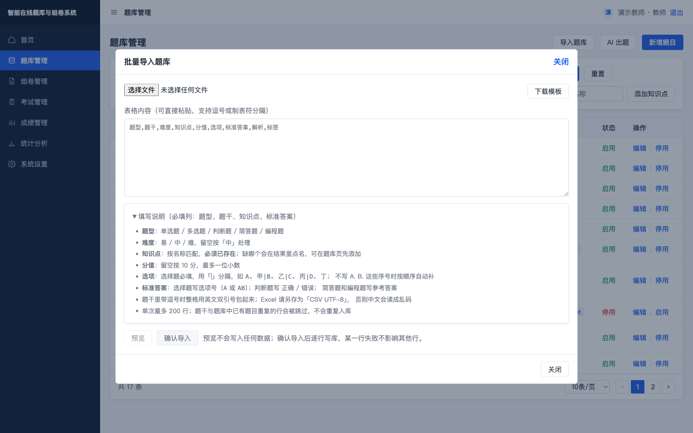 | 导入弹窗：可选文件也可直接粘贴，两条路径走同一个接口。右上「下载模板」由后端生成，模板的表头就是解析器认得的列名，两者不会各自漂移。此时**「预览」和「确认导入」都是灰的**——没有内容不给预览，没预览过不给写库 |
| 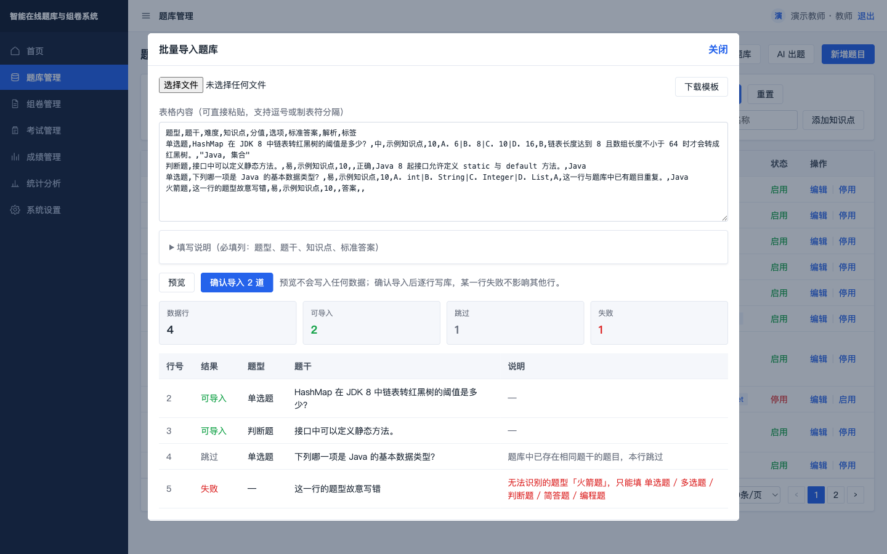 | 预览（`dryRun=true`，服务端不写任何数据）：统计卡给出「数据行 4 / 可导入 2 / 跳过 1 / 失败 1」，逐行标出**原文行号**、结果与原因——第 4 行与题库已有题目重复所以跳过，第 5 行题型写成「火箭题」所以失败且标红。确认按钮变为「确认导入 2 道」 |
| 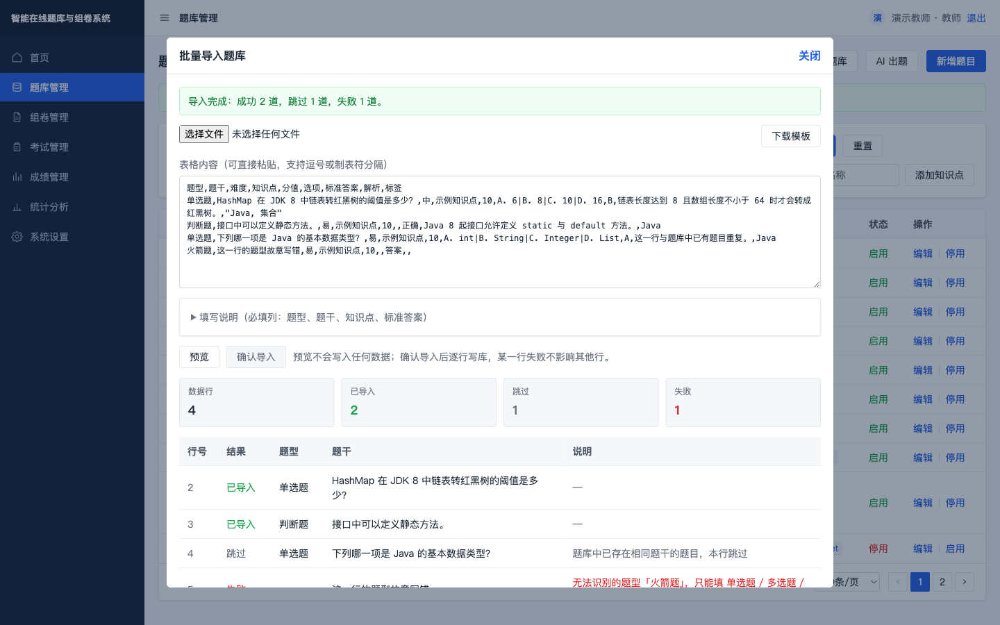 | 确认导入后：「可导入」变为「已导入」，弹窗提示「导入完成：成功 2 道，跳过 1 道，失败 1 道」，页面提示「已导入 2 道题目到题库」。确认按钮随即禁用，同一批内容不能重复提交；弹窗刻意不自动关闭，跳过与失败的原因还需要教师看完 |

三个数字是这一功能的全部价值所在：**预览说 2 道，实际就写 2 道**。预览与导入是同一段服务端代码，只差最后一步写不写库，因此不可能出现「预览说能导入 18 道、实际只进了 12 道」。

### 4.4 教师：组卷与考试

| 截图 | 说明 |
|---|---|
|  | 穿梭式手动组卷：左侧题库候选、右侧试卷内容，逐题填写分值，**总分由各题分值实时汇总为 40**，不允许单独填写一个不一致的总分；支持上移/下移/删除 |
|  | 考试管理：基于已发布试卷创建考试草稿并设置开放时间；只有草稿有「发布」操作，已发布的考试不提供撤回，因为可能已有学生答卷 |

**规则自动组卷与试卷导出**是组卷页上另外两个入口，它们都刻意不新增写入路径：

| 截图 | 说明 |
|---|---|
| 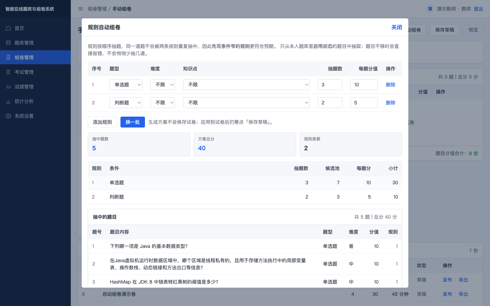 | 规则自动组卷：两条规则（单选题抽 3 道每题 10 分、判断题抽 2 道每题 5 分）→「抽中题数 5 / 方案总分 40 / 规则条数 2」。规则表除了抽题数还给出**候选池大小**（7 与 3）：池子等于抽题数时会标「无可换」，省得教师一直点「换一批」却发现题目没变 |
| 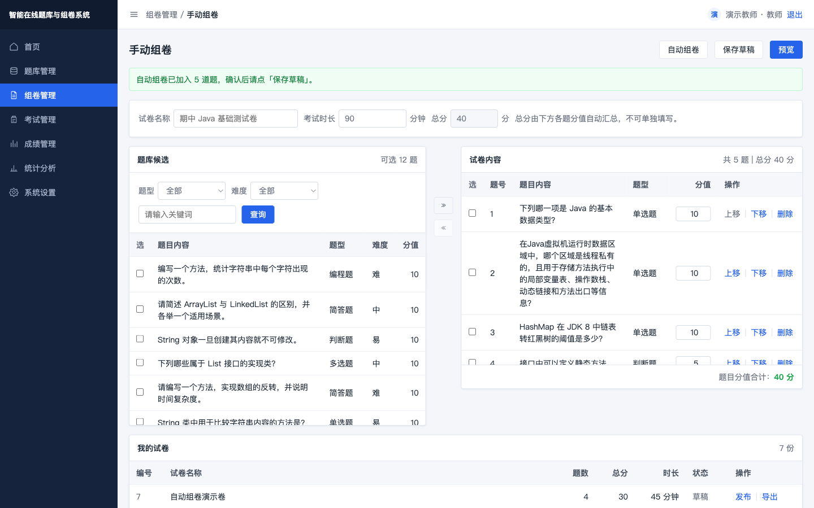 | 点「应用到试卷 5 道」后，方案被填进右侧「试卷内容」，总分自动汇总为 40，页面提示「自动组卷已加入 5 道题，确认后请点『保存草稿』」。**保存走的仍是手工组卷那一个接口**，因此分值合计、题目归属与启用状态的校验只有一处实现 |
| 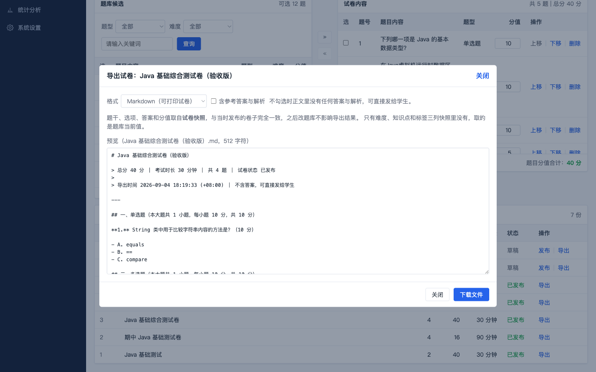 | 试卷导出（Markdown，不含答案）：弹窗直接显示要下载的正文——卷头是总分/时长/题数/状态/导出时间，正文按大题分组（「一、单选题（本大题共 1 小题，每小题 10 分，共 10 分）」），**没有任何答案与解析**，可直接发给学生。改任何选项都会立刻重新取一次，避免下载后才发现带了答案 |
| 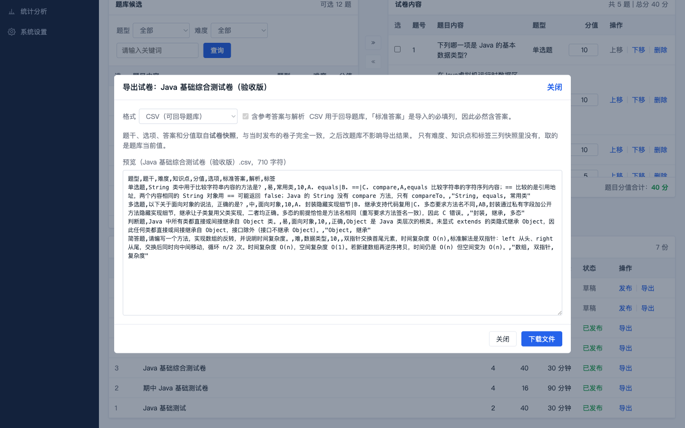 | 切到 CSV 后「含参考答案与解析」开关**变灰并锁定为勾选**，旁边说明原因：「CSV 用于回导题库，『标准答案』是导入的必填列，因此必然含答案」。CSV 的列名与顺序等于题库导入模板，因此这份文件可以原样喂回「导入题库」 |

### 4.5 学生：答题与交卷

| 截图 | 说明 |
|---|---|
|  | 学生端整页界面，无侧栏。已交卷的考试其「进入考试」按钮为灰色禁用，可参加的为蓝色可点 |
|  | 单题作答 + 右侧题号导航 + 顶栏剩余时间与「已答 n/N」。题号方块按未答/已答/当前三态着色 |
|  | 简答题作答，四个题号全部变绿（已答 4/4）。切题时自动把答案同步到服务端 |
|  | **整页刷新后重新进入**：答案全部还在（已答 4/4，第 1 题仍选中 A），倒计时按服务端记录的开始时间继续 |
|  | 交卷二次确认后提示「交卷成功。客观题得分 **20** 分，简答题和编程题等待教师评阅」——与验收数据一致 |

### 4.6 教师：阅卷、公布与排名

| 截图 | 说明 |
|---|---|
|  | 阅卷面板：答卷 1、作答中 0、待批主观题 1、已评卷 0。平均分/最高/最低/及格率此时显示 **`—` 而不是 0**；「公布成绩」按钮禁用并说明「还有 1 道主观题未评分」 |
|  | 阅卷弹窗逐题显示题干、学生作答、标准答案、解析与得分，客观题标注「系统自动判分」；顶部提示「成绩尚未公布，学生端此时看不到分数、标准答案和评语」 |
|  | 简答题评 8 分并写评语后，右侧「已评 8 分」，背景表格总分立刻变为 **28**（客观 20 + 主观 8），待批变为 0/1，「公布成绩」按钮解禁。得分输入框上界为该题满分 10 |
|  | 公布后：平均分 28、最高 28、最低 28、及格率 100%、公布时间可见，答卷状态变为「已评分」，排名表出现第 1 名。按钮变为「已公布成绩」且禁用 |
|  | 同分并列演示：四名学生得 20/10/10/0，名次为 **`1、2、2、4`**——并列的第 2 名占用了第 3 名的位置。平均分 10、最高 20、最低 0、及格率 25% |

### 4.7 统计分析

| 截图 | 说明 |
|---|---|
|  | 上半部分是题库概况与题型/难度/知识点三张分布图（**计数为 0 的题型也会出现在图上**，否则会让人误以为该题型不存在）；下半部分是单场考试的成绩分布与逐题作答分析 |

这张图上有四处值得在答辩时主动指出的细节：

1. **及格线写明来源**：「及格线 24 分（试卷满分 40 × 60%）」——60% 是本项目选定的通用取法，课程未作规定，因此把算式显示出来而不是只给一个数字。
2. **成绩分布**：28 / 40 = 70%，落在「70—79%」这一段，该段显示 1 份 100%；其余四段显示 0 而不是被隐藏。
3. **逐题作答分析**：单选正确率 100%、多选 **0%（标红）**、判断 100%、简答的正确率是 **`—`** 而得分率 80%。
4. **统计范围**：明确写出「统计范围为当前教师自己创建的题目、试卷与考试」，避免把统计误读成全站数据。

这张图是在批量导入落地后重新采集的，因此题库计数（题目 18、知识点 7、题型分布合计 18）与首页一致；导入进来的 7 道题都归在「示例知识点」下，在知识点分布图上占 38.9%。

### 4.8 学生查分与系统设置

| 截图 | 说明 |
|---|---|
|  | 学生只看到**已公布**的考试，且只有本人成绩与名次：28/40「第 1 名 / 共 1 人」、20/20「第 1 名 / 共 4 人」 |
|  | 公布后的答卷回看：客观 20、主观 8、总分 28、满分 40、名次 1，逐题显示本人作答、标准答案、解析、得分与教师评语 |
|  | 系统设置的只读部分：Spring Boot 3.5.16 / Java 25.0.2、服务端时区、MySQL 9.6.0 与 Flyway 版本、JWT HS256、BCrypt、自动交卷扫描 30 秒、排名规则、AI 配置状态。**明确标注「不展示连接地址与账号密码」，AI 密钥只以「已配置」体现**（这张图采集于设置页开放编辑之前，可编辑部分见下方两张） |

**错题本与错题重练**是学生端的第三个页签。它与成绩公布这道闸门绑在一起——公布前一个字都不会出现：

| 截图 | 说明 |
|---|---|
| 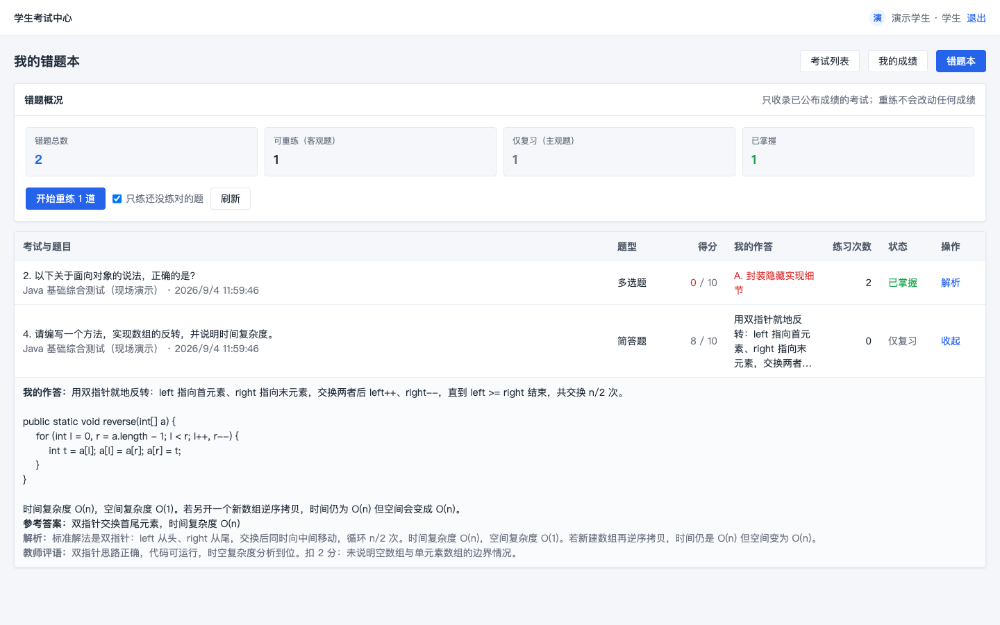 | 错题本：概况卡给出「错题总数 2 / 可重练（客观题）1 / 仅复习（主观题）1 / 已掌握 1」。多选题一行得分标红 `0 / 10`，简答题一行是 `8 / 10` 且状态为「仅复习」——**收录标准是「未得满分」而不是「得 0 分」**。展开后显示本人完整作答、参考答案、解析和教师评语；长作答在列表里截断、在展开区完整显示 |
| 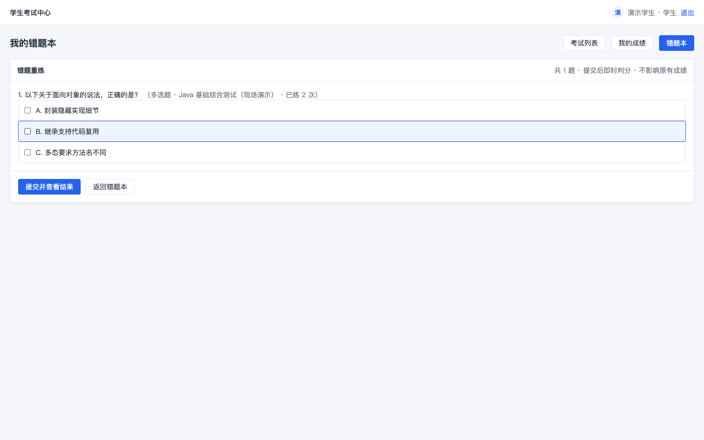 | 重练界面：只有可自动判分的客观题，**看不到标准答案，也看不到上次答错的选项**——否则重练就是抄一遍答案。右上写明「共 1 题 · 提交后即时判分 · 不影响原有成绩」 |
| 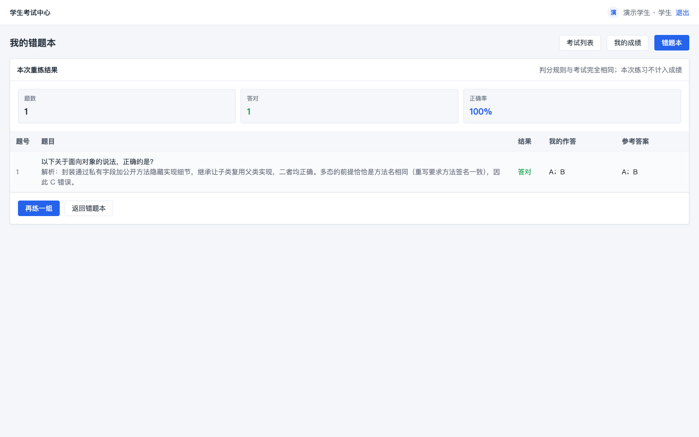 | 提交后才给出结果：「题数 1 / 答对 1 / 正确率 100%」，逐题显示对错、我的作答、参考答案与解析。判分复用交卷时的同一套规则（多选必须集合完全一致）。返回「我的成绩」核对，总分仍是 28 / 40 —— **重练不改动任何成绩** |

**可编辑的系统设置**是管理员一侧的新增能力。这一页原先是纯只读的，开放编辑靠的是把界限划清楚：

| 截图 | 说明 |
|---|---|
| 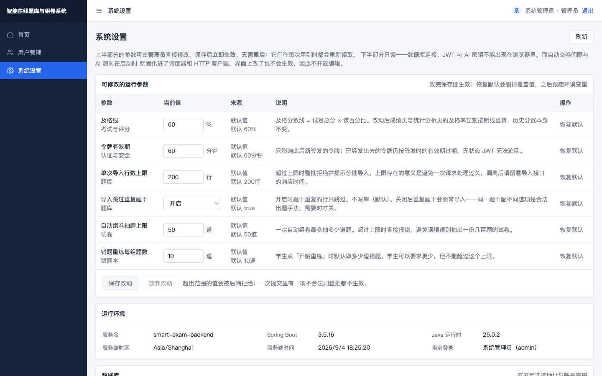 | 六项可修改参数，每行给出**当前值输入框 + 来源 + 默认值 + 说明 + 恢复默认**。此时全部为「默认值」，因此「恢复默认」与「保存改动」都是灰的。页首一句话说明了哪些能改、哪些不能改以及为什么 |
| 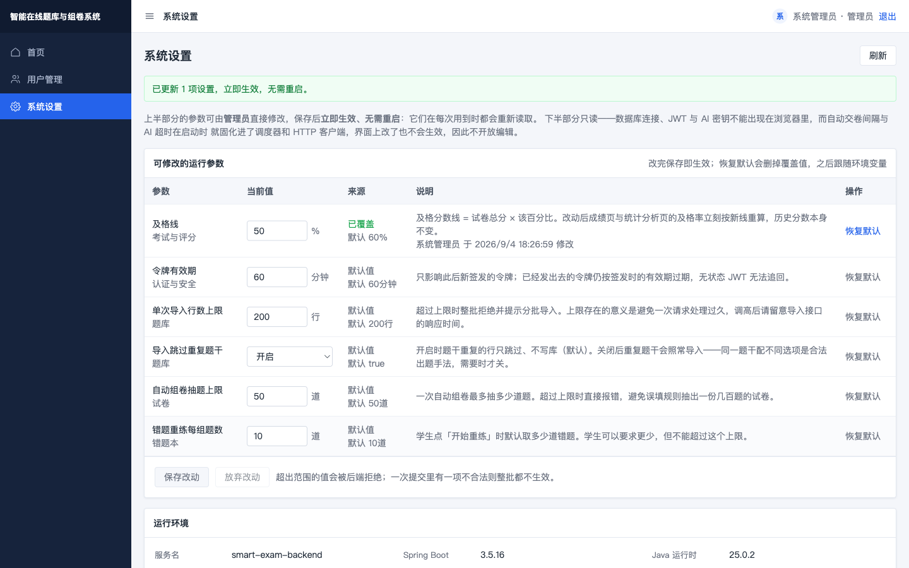 | 把及格线从 60 改成 50 并保存：提示「已更新 1 项设置，立即生效，无需重启」，来源变为绿色「已覆盖」，并记下「系统管理员 于 2026/9/4 18:26:59 修改」。此时教师端的成绩页与统计分析页的及格率会**立刻**按新线重算（实测 25.0% → 75.0%，及格分数线 12.0 → 10.0），不需要重启后端 |

### 4.9 异常与权限（命令行现场验证）

界面上点不出越权，因此这部分用 `curl` 直接打接口更有说服力。以下是 2026-09-04 在真实环境上的实际输出：

| 场景 | 结果 |
|---|---|
| 学生甲访问本人答卷 | `200` |
| 学生乙访问学生甲答卷 | `403` |
| 学生乙访问 `/my/results/{学生甲答卷}` | `403` |
| 未登录访问题库 | `401` |
| 学生访问教师题库接口 | `403` |
| 教师传 `page=0` / `size=101` / 非法枚举 | `400 VALIDATION_ERROR` × 3 |
| 学生重复交卷 | `409 SUBMISSION_ALREADY_SUBMITTED`「答卷已经提交」 |
| 教师重复公布成绩 | `409 INVALID_STATE_TRANSITION`「成绩已经公布」 |
| 该考试的答卷份数 | `1`（唯一约束生效） |

三层防护缺一不可：`SecurityConfig` 按 URL 前缀限角色、Controller 的 `@PreAuthorize` 收紧到具体方法、Service 再校验资源归属。前端隐藏按钮只是体验优化，不构成任何权限保证。

---

## 5. 运行结果分析

评价要点明确列出「设计报告中对程序运行结果的分析」。下面逐个解释**为什么数字是这个值**，而不是只说「测试全部通过」。

**客观题为什么是 20 分而不是 30 分。** 单选答对得 10，多选**少选**得 0，判断答对得 10。规则是「答案集合完全一致才得分，不给部分分」。少选不给分是刻意的选择：部分分需要额外定义评分规则（少选给一半？错选倒扣？），而 MVP 选择了确定性最强的一种，代价是对学生偏严。这个 0 分反映的是**评分规则**，不是学生完全不会。

**总分 28 = 20 + 8。** 主观题评分后立即重算 `subjective_score` 与 `total_score`。两部分都已是一位小数，相加不引入新的精度问题；分值全程用 `DECIMAL(6,1)` 和 `BigDecimal`，不用浮点数，因此不会出现 `19.999999` 这类结果。

**排名为什么是 `1、2、2、4` 而不是 `1、2、2、3`。** 竞赛排名下并列名次要占用位置。四份答卷 20/10/10/0，两个 10 分并列第 2，第 3 名的位置被占掉，0 分那份直接是第 4。这与体育比赛的名次规则一致，也是教务场景的通行做法。

**及格率 25.0% 怎么来的，以及为什么它会变成 75.0%。** 及格线取试卷总分的 60%（20 × 0.6 = 12），四份答卷只有 20 分那份达标，1/4 = 25.0%。60% 是本项目选定的通用取法，课程未规定，因此在界面和文档中都写明了算式。它现在是一个**可配置项**：管理员在系统设置里把及格线改成 50% 后，及格线降到 10 分，三份答卷达标，及格率立刻变成 75.0%，统计分析页的及格分数线同步从 12.0 变成 10.0。两个页面同时变化不是巧合——它们读的是同一处实现。这也说明「及格率」这个数字必须连着及格线一起报，否则脱离前提就没有意义。

**平均分为什么只算已评完的答卷。** 未批完的答卷主观题还是 0 分，计入会把平均分拉低，得出一个**随阅卷进度变化的假平均分**。统计口径因此限定为「已交卷且主观题全部评完」，界面上也把这句话写了出来。

**重复交卷为什么返回 409 而不是 200。** 交卷是一次状态跃迁而非幂等写入，二次请求代表客户端状态与服务端不一致。用 409 让前端明确知道要刷新，而不是静默成功让用户以为又交了一次。数据库里始终只有一份答卷，可现场查证。

**逐题正确率为什么单选 100%、多选 0%。** 正确率的分母是已交卷答卷数，分子是**满分人数**。学生甲单选答对（10/10，满分）、多选少选（0/10，非满分），因此两题的正确率分别是 100% 和 0%。

**主观题的得分率 80% 怎么来的。** 简答题满分 10 分、评了 8 分，8/10 = 80%。得分率在客观题和主观题上口径一致，因此可以跨题型比较难度；而正确率只对客观题有意义，主观题显示 `—`。

**成绩分布为什么落在 70—79%。** 28 / 40 = 70.0%，落入 `70—79%` 分段。分段按占试卷满分的百分比而不是绝对分数，这样不同满分的试卷可以横向比较。

**重练答对了，为什么考试那一题的得分还是 0。** 错题重练与考试是两套独立的数据：练习记录写在 `practice_attempt` 表，考试成绩在 `submission` 与 `submission_answer` 里。实测练对之后，错题本显示「练习次数 2、已掌握」，而该题在考试里的得分仍是 `0.0`、答卷总分仍是 `28.0`、状态仍是 `GRADED`。这是刻意的：已公布的成绩不能被学生自己的练习改写，否则「成绩」二字就失去了意义。

**自动组卷的方案总分为什么恰好等于各规则小计之和。** 方案总分 = Σ(每条规则的抽题数 × 每题分值)，实测两条规则 3×10 + 2×5 = 40。之所以强调这一点：方案是要被原样提交给组卷接口的，而那个接口要求「逐题分值合计严格等于总分」——如果自动组卷自己算出一个对不上的总分，保存那一步必然失败。实测把方案原样提交后一次保存成功，试卷总分 30.0、题数 4，说明两处口径一致。

**注释 37.8% 是保守值。** 统计脚本只计整行注释，`code(); // 说明` 这类行尾注释不计入，因此真实注释密度高于该数字。本次新增四项功能后总量从 8748 行代码涨到 11783 行，比例仍保持在 37.8%（后端主源码 60.3%）。

---

## 6. 测试与验证

### 6.1 自动化测试

| 项 | 数量 | 结果 |
|---|---:|---|
| 后端（MockMvc 集成测试 + 协议单元测试） | 55 | 全部通过，`BUILD SUCCESS` |
| 前端（Vitest + Vue Test Utils） | 55 | 全部通过 |
| 前端静态验证 | 3 | TypeScript 类型检查、oxlint + eslint、生产构建均通过 |

后端 55 项按模块分布：健康检查 1、认证 4、题库 7、批量导入 6、考试与判分 4、阅卷与成绩 3、用户管理 3、AI 10（草稿流程 5 + 协议报文 5）、统计 4、自动组卷 3、试卷导出 3、错题本与重练 3、可编辑设置 4。AI 测试使用桩客户端，**不联网、不消耗额度**。

批量导入的 6 项里有一条是**防漂移测试**：把后端生成的模板原样喂回导入接口，断言五行示例全部通过校验。模板与解析器一旦脱节，教师下载下来照着填反而会报错，而这种问题在代码评审里最不容易被发现。另一条用「标准答案写 C、但选项只有 A 和 B」这一行证明导入没有绕过业务校验——它在格式上完全合法，只有跑一遍 `validateDraft` 才拦得下来。

四项新增功能的测试也各自钉住了一条最容易出问题的承诺：**自动组卷**把生成的方案原样提交给组卷接口，断言一次保存成功——如果方案会被组卷校验拒掉，这个功能就是坏的；**试卷导出**把导出的 CSV 直接喂回导入接口，断言 4 行全部导入成功，同时断言「不含答案」的 Markdown 里连解析的字面内容都不出现；**错题重练**在练对之后断言答卷的 `total_score` 仍是 `28.0`、该题得分仍是 `0.0`，并断言未公布成绩的考试里答错的题无法通过重练接口换到标准答案；**可编辑设置**用「改及格线 → 成绩接口的及格率从 25.0 变成 75.0 → 恢复默认后回到 25.0」这条链路证明「改完真的生效、恢复默认真的还原」。

九项核心验收用例全部由自动化覆盖，逐项证据见 [`docs/test-records.md`](test-records.md)。断言里写死了验收数字（`objectiveScore = 20.0`、`totalScore = 28.0`、名次 `1、2、2、4`、`passRate = 25.0`），任何改动判分逻辑的修改都会立刻让测试变红。

### 6.2 真实环境验证

自动化测试跑在 H2 上，因此另外在真实 MySQL 9.6 上完整走了一遍，全部验收数字复现一致：

```
客观题 20.0  主观题 8.0  总分 28.0
平均分 10.0  最高 20.0  最低 0.0  及格率 25.0%
名次 [(1, 演示学生, 20.0), (2, 学生乙, 10.0), (2, 学生丙, 10.0), (4, 学生丁, 0.0)]
```

AI 辅助出题也在真实服务商上验证通过：OpenAI 兼容协议、模型 `deepseek-v4-flash`，生成 2 道草稿全部通过校验、0 道被丢弃，其中 1 道经教师确认后保存入库。系统设置接口的响应中检索 `sk-` 的结果为 `False`，**密钥不外泄**。

四项新增功能也全部在真实 MySQL 9.6 上走查（完整记录见 [`docs/test-records.md`](test-records.md) 第 8 节）：V5 迁移实测应用成功（`now at version v5`），新增 `system_setting` 与 `practice_attempt` 两张表且既有数据不受影响；自动组卷的方案原样保存成 30 分 4 题的试卷；导出的 CSV 被导入接口读回 4 行全部成功；管理员改及格线后成绩页及格率 25.0% → 75.0%、统计页及格线 12.0 → 10.0，恢复默认后回到原值；错题重练两次后错题本显示「练习次数 2、已掌握」而答卷总分仍是 28.0。浏览器走查另留存 9 张截图（`31`—`39`），并修复了 3 个只有看界面才能发现的缺陷。

批量导入同样在真实 MySQL 上逐条核对（完整记录见 [`docs/test-records.md`](test-records.md) 第 7 节）：模板五行示例导入 5 成功 0 失败，题库总数 11 → 16；预览前后题库总数不变，证明预览确实不写库；同一份内容再导一次得到 `imported=0 skipped=5`；题型写错、答案指向不存在的选项、分值写成 `abc`、判断题答案写「也许」四行各自失败并给出原文行号，同一批里的好行照常写入；缺必填列、只有表头、201 行三种整表错误分别返回 `IMPORT_INVALID_FORMAT` 与 `IMPORT_TOO_MANY_ROWS`；未登录 401、学生与管理员 403。

### 6.3 注释比例

课程要求「注释数量多于代码的 1/3」。用 `python3 scripts/comment-ratio.py` 统计（只计整行注释）：

| 分组 | 注释行 | 代码行 | 注释/代码 |
|---|---:|---:|---:|
| 后端主源码 | 2394 | 3969 | 60.3% |
| 后端测试 | 597 | 2171 | 27.5% |
| 前端脚本与组件 | 1370 | 5305 | 25.8% |
| 样式 | 92 | 338 | 27.2% |
| **合计** | **4453** | **11783** | **37.8%** |

结论：37.8% > 33.3%，达标。

---

## 7. 创新性与已知边界

### 7.1 创新性

本项目的创新点偏工程实现而非功能新奇，如实列出以下十一条：

1. **AI 辅助出题的双协议适配。** 同时支持 OpenAI 兼容协议与 Anthropic Messages 协议，换服务商只改四个环境变量。适配层刻意**不发** `response_format: json_object`——OpenAI 和 DeepSeek 支持它，但 vLLM、Ollama 等本地服务未必认，改为提示词约束加解析端容错，兼容性更广。
2. **AI 输出的形态归一化 + 复用校验。** 把模型给的 `"AB"` 拆成 `["A","B"]`、`"正确"` 转 `true`、选项键统一大写，**只改形态不改内容**，正确性仍交给原有校验；部分草稿不合规时保留合规的并说明被丢弃的原因，而不是整批作废或静默少给。
3. **成绩可见性的字段级裁剪。** 同一个响应结构服务教师阅卷、学生答题回看、学生查分三个场景，按「谁在看 + 是否已公布」裁剪字段，并用 `null` 与 `0` 区分「不可见」与「真的 0 分」。
4. **服务端超时自动交卷。** 不依赖浏览器保持打开，配合答案随时同步，保证「关掉页面」和「正常交卷」得到同一个判分结果。
5. **快照式组卷。** 试卷保存题目五项快照，使题库可以自由修改而历史试卷、答卷和成绩完全不受影响。
6. **统计口径的单一实现。** 统计分析页不重算成绩，平均分、最高分、及格率与排名全部来自成绩接口的同一份实现，同一个数字只有一处实现，两个页面就不可能对不上。
7. **零图表库的可视化。** 分布图用 CSS 条形图自绘并按最大值等比缩放，运行时依赖始终只有 Vue 一个。
8. **批量导入的「预览即结果」。** 预览与导入是同一段服务端代码，只差最后一步写不写库，因此预览给出的可导入行数就是实际写入的行数；`dryRun` 缺省为 `true`，漏传参数只会什么都不发生。三条入题库的入口（手工、AI 草稿、批量导入）共用同一套校验与同一段答案归一化，导入没有任何绕过通道；逐行独立事务让 50 道里错 3 道时只需要改这 3 道。CSV 解析同样没有引入依赖——自写约 90 行状态机处理 BOM、分隔符探测、引号内的逗号与换行，并记录**原文行号**，使报错能落到教师在 Excel 里看到的那一行。
9. **「只有一条写入路径」被推广到了组卷。** 规则自动组卷只抽题、只返回方案，保存仍走手工组卷那一个接口；因此「分值合计等于总分」「题目属于本人」「题目处于启用状态」这三条校验在整个系统里只有一处实现。加上题库的三条入口共用一套校验，本项目里**每一种业务对象都只有一条写入路径**——这是一条贯穿全局的约束，而不是某个功能的局部技巧。抽题不够时直接报错而不是少抽，也出自同一种取舍：宁可让用户看见失败，也不交付一件安静地缺了一块的东西。
10. **导出与导入是配套的一对。** 试卷可以导成 CSV，而这份 CSV 的列名与顺序等于题库导入模板，因此它能被本系统的导入接口原样读回——一份试卷可以搬到另一位教师的题库或另一套环境。自动化测试直接把导出结果喂给导入接口来固定这个约定，两边的转义规则（RFC 4180、UTF-8 BOM）也因此不会各自漂移。同一个功能还提供不含答案的可打印版本，「含答案」这个开关做成了带预览的，因为一份本该发给学生的卷子带上答案，问题已经发生了。
11. **错题重练与成绩严格分离。** 错题只来自已公布成绩的考试（公布前一个字都不出现）；练习集刻意不下发标准答案，答案只在提交后返回，否则重练就是抄一遍答案；判分复用交卷时的同一个比较器，不会出现「考试判错、重练判对」；练习记录写在独立的表里，**已公布的成绩不能被学生自己的练习改写**。四条约束合起来才让「重练」既有用又不破坏成绩的权威性。

### 7.2 已知边界

如实列出，不藏问题——这些都写进了 [`docs/test-records.md`](test-records.md) 第 5 节。

| 项 | 现状 | 影响 |
|---|---|---|
| MySQL 8.4 空库迁移 | V1—V5 已在本机 **MySQL 9.6** 实测应用成功，但未在 8.4 的空库上从零跑过 | 9.6 通过不等于 8.4 通过；Flyway 也提示 9.6 未经测试 |
| 自动化测试的数据库 | 只跑 H2 手写 schema，不执行 Flyway | H2 与 MySQL 在 ENUM、JSON、CHECK 上的差异不会被测试发现 |
| 服务端试卷时长约束 | 只按考试 `end_at` 自动交卷 | 试卷时长目前主要由前端倒计时约束，学生若绕过前端可在考试窗口内答满全程 |
| 令牌吊销 | 不维护吊销名单 | 已签发 JWT 在过期前仍具密码学有效性，停用账号靠每次请求回查用户状态拦截——这是有意取舍 |
| 性能指标 | 未测 | 不声称达到 `plan.md` 中的并发与响应时间目标 |
| 干净环境 10 分钟启动 | 未从零复现 | 影响「新环境可重复启动」这一完成标准 |
| 导入的文件编码 | 只按 UTF-8 解码 | Excel 的「CSV 逗号分隔」是 GBK，会读成乱码；界面上已明确提示另存为「CSV UTF-8」 |
| 自动组卷的随机性 | 每次抽题都是新的随机组合，测试只断言数量、去重与筛选条件 | 这是刻意的（「换一批」），代价是同一批规则两次生成的卷子不同，不适合要求「可重现同一份卷子」的场景 |
| 错题本与多场考试复用同一试卷 | 同一份试卷被两场考试引用时，同一道题可能在错题本里出现两行 | 练习记录按试卷题目聚合，两行共享练习次数与「已掌握」标记；课程演示规模下不影响使用 |
| 系统设置的多实例部署 | 覆盖值缓存在进程内存里，写入后立即失效重载 | 单实例正确；多实例需要改成带过期时间的缓存或写入后广播 |

---

## 8. 心得体会

**踩过的第一个坑是时区，它教会我「谁生成数据」必须是一个明确的设计决定。** 答题倒计时莫名多出 8 小时。排查后发现 `submission.started_at` 用了数据库的 `CURRENT_TIMESTAMP` 默认值——按会话本地时区写入、按 UTC 读出，于是产生了固定偏移。修法是连接串强制 UTC 会话时区，并让后端显式写入这个时间。这个 bug 让我明白，"顺手交给数据库默认值" 看起来省事，实际是把一个跨系统的语义约定丢给了两边各自的默认配置。

**第二个坑更严重：超时自动交卷判了空白卷。** 早期版本只在点「交卷」时才把答案提交到服务端，于是学生超时未交时，后端拿到的是一张空白卷，直接判 0 分。功能测试全都通过，因为测试里的学生都乖乖点了交卷。修法是让答案随时同步到服务端。教训是：**兜底机制本身也需要数据支撑**，不能只有状态流转——一个只会把状态从「作答中」改成「已交卷」的兜底逻辑，等于把学生的成绩清零。

**第三个坑是测试之间互相污染。** 加 AI 测试时用了 `@MockitoBean`，Spring 因此建了第二个应用上下文并重跑一次建表脚本；脚本只删了一张表，在「表已存在」处中断，后面所有测试都因为查不到账号而 401。表面症状是「认证坏了」，真实原因在测试基础设施。修法是让建表脚本可重复执行。这件事之后我对「共享的测试基础设施必须是幂等的」有了具体的体感。

**一个反复出现的判断：安全边界只能放在服务端。** 成绩公布前的字段裁剪、题目归属校验、评分上界、公布前置条件，全部在后端实现，前端的按钮禁用只作为体验优化。做界面时很容易图省事只在前端拦——按钮灰了用户就点不到了。但浏览器里能看到的就等于已经泄露，`curl` 一下就能绕过所有前端逻辑。这也是我最后专门用命令行验证越权路径的原因：界面上点不出越权，不代表接口拦得住。

**一个关于 AI 的判断：让 AI 只生成草稿。** 实现 AI 辅助出题时，最省事的做法是让模型直接写库。但那样模型的输出就绕过了全部业务校验——它可能给出四个选项却把标准答案写成 `E`，也可能把判断题的答案写成一句话。最后的做法是：题型、难度、知识点、分值由人指定，模型只创作内容；输出必须过和手工出题完全相同的校验；保存走同一个接口。**AI 提高的是效率，不应该降低系统的确定性。** 这条边界让我在真实联调时受益：第一次调用因为账号余额为 0 返回了 400，系统干净地降级为「AI 服务返回 400，请检查密钥、模型名与配额」，手工出题完全不受影响。

**一个关于「完成」的认识转变。** 项目中段我以为功能写完就算完成了，直到用浏览器完整走查一遍——才发现管理员登录会触发四个 403、`RESULTS_PUBLISHED` 状态在首页被显示成「草稿」、「不能停用自己」的禁用按钮和普通按钮长得一模一样、选项编辑器里的「删除」被挤成上下两行。这些都不是后端逻辑错误，自动化测试也全绿，但它们全都会出现在验收现场。**「测试通过」和「可以交付」之间还有一段距离，这段距离只能靠把自己当用户走一遍来跨过。**

**一次范围扩张给我的检验。** 项目后期又追加了规则自动组卷、错题本与重练、试卷导出和「系统设置改为可编辑」四项功能。这是对前期设计的一次真实检验：自动组卷没有新增写库路径（保存仍走原来的组卷接口）、重练没有碰成绩表、导出复用了导入的列格式、判分复用了交卷的比较器——**新功能全部挂在既有约束上，而不是各自开一条新路**。唯一一次真的需要改主意的是系统设置：它原先被我明确设计成只读，理由写在代码注释里（「可编辑表单会造成界面改完但进程没重启」）。要开放编辑，我没有推翻那个理由，而是把它变成一条筛选标准——只有「每次用到都会重新读取」的参数才进白名单，启动时固化的调度间隔和 HTTP 超时一律不开放。**当新需求与旧决定冲突时，先弄清旧决定在防什么，往往能找到一个两者都满足的做法。**

**关于单人开发的质量保证。** 没有第二个人复核，就得让证据自己说话：把验收数字写死进测试断言、逐日记录改动与验证、浏览器走查留存截图、在真实数据库上复现一遍。其中最有效的是第一条——20 分、28 分、`1、2、2、4` 这几个数字一旦写进断言，我就不可能在不知情的情况下改坏判分逻辑。

**关于工程取舍的诚实记录。** 令牌无法吊销、试卷时长目前主要由前端约束、自动化测试只跑 H2 而非 Flyway、性能指标未测——这些都是已知边界，我把它们写进了文档而不是藏起来。一份声称「已全部实现」的文档在验收时经不起一个追问；而一份写清了边界的文档，反而让人相信没写出来的部分是真的做到了。

---

## 附录：复现步骤

```bash
# 1. 初始化（首次）：生成 .env、建库、装依赖
./scripts/init-local.sh

# 2. 加载环境变量
set -a && source .env && set +a

# 3. 启动后端（终端 A）与前端（终端 B）
mvn -f backend/pom.xml spring-boot:run
npm --prefix frontend run dev

# 4. 打开 http://localhost:5173，用 teacher / ExamDemo123! 登录
#    后端健康检查：http://localhost:8080/api/health

# 5. 复核本报告中的数字
mvn -f backend/pom.xml test                              # 后端 55 项
npm --prefix frontend run type-check                     # 类型检查
npm --prefix frontend run lint                           # oxlint + eslint
npm --prefix frontend exec -- vitest run --root frontend # 前端 55 项
npm --prefix frontend run build-only                     # 生产构建
python3 scripts/comment-ratio.py                         # 注释比例 37.8%
```

演示动线与每步预期结果见 [`docs/demo-script.md`](demo-script.md)；逐项测试结果见 [`docs/test-records.md`](test-records.md)；开发过程记录见 [`log.md`](../log.md)。

AI 辅助出题为可选功能，需在 `.env` 中配置 `AI_PROTOCOL` / `AI_BASE_URL` / `AI_MODEL` / `AI_API_KEY` 四项；**密钥只存在于本地 `.env`（已被 `.gitignore` 排除），不在仓库、日志或接口响应中出现**。未配置时该功能会提示未配置并降级，不影响其余流程。
