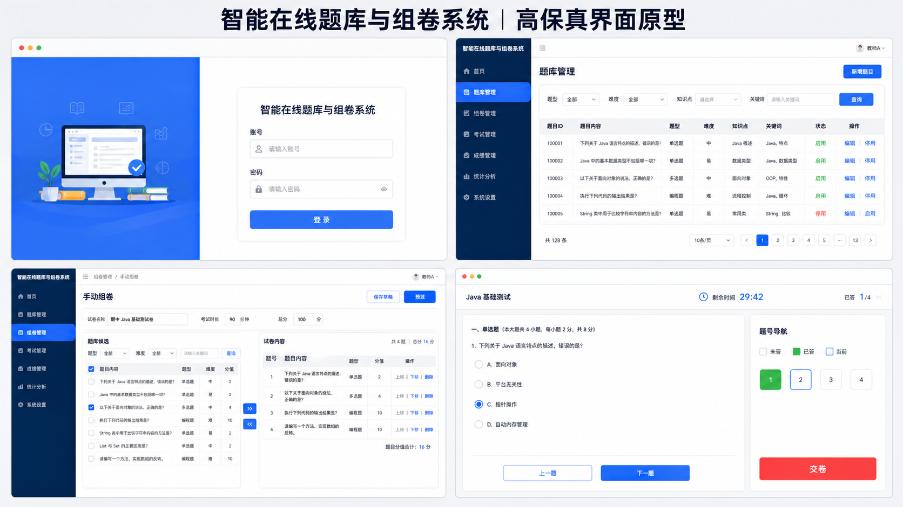

# 页面与流程原型说明

## 1. 原型总览



该原型是界面实现的依据：登录、题库管理、手动组卷和学生答题四个页面必须照此实现。图片本身不作为已实现或已验收的证据。

## 2. 信息架构

| 角色 | 一级页面 | 核心操作 |
|---|---|---|
| 公共 | 登录 | 输入账号密码、查看失败原因 |
| 管理员 | 用户管理 | 查询、新增、禁用用户 |
| 教师 | 工作台、题库、试卷、考试、阅卷、成绩、统计分析、系统设置 | 建题、组卷、发布、阅卷、公布、统计分析、核对环境 |
| 学生 | 可参加考试、答题页、我的成绩 | 作答、保存、恢复、交卷、查看本人答卷与名次 |

## 3. 核心页面草图

### 3.1 教师题库

```text
┌──────────────────────────────────────────────────────────┐
│ 题库管理                         [新增题目]               │
├──────────────────────────────────────────────────────────┤
│ 题型 [全部▼] 难度 [全部▼] 知识点 [全部▼] 关键词 [____] [查]│
├────┬──────────────┬──────┬────────┬──────┬───────────────┤
│ ID │ 题干摘要      │ 题型 │ 难度   │知识点│ 操作          │
│ 1  │ Java 中……    │ 单选 │ 中等   │ Java │ 编辑 停用     │
└────┴──────────────┴──────┴────────┴──────┴───────────────┘
```

新增/编辑题目根据题型切换答案控件；提交失败时保留输入并在字段附近显示原因。

### 3.2 教师组卷

```text
┌────────────────────题库候选────────────────┬────试卷内容────┐
│ 筛选条件                     [加入试卷]     │ 名称 [______] │
│ □ 单选题 A  □ 判断题 B  □ 简答题 C          │ 时长 [30] 分  │
│                                             │ 1. A [10分]   │
│                                             │ 2. B [10分]   │
│                                             │ 总分：20      │
│                                             │ [保存][预览]  │
└─────────────────────────────────────────────┴──────────────┘
```

发布前必须经过预览和完整性校验；总分由题目实际分值实时汇总，不允许用户单独填写一个不一致的总分。试卷内容支持逐题填写分值以及上移、下移和删除。

### 3.3 学生答题

```text
┌──────────────────────────────────────────────────────────┐
│ Java 基础测试                   剩余 29:42    [交卷]      │
├──────────────┬───────────────────────────────────────────┤
│ 题号导航      │ 1. 以下说法正确的是？                     │
│ [1][2][3][4] │ ○ A  ○ B  ○ C  ○ D                       │
│ 已答 1/4      │                                           │
│              │ [上一题]                         [下一题] │
└──────────────┴───────────────────────────────────────────┘
```

交卷前提示未答数量并二次确认；答案保存后刷新可恢复；倒计时归零自动交卷。

### 3.4 阅卷与成绩

教师查看完整答卷并批阅简答题，全部批完后公布；成绩页显示排名及平均/最高/最低分。学生仅在公布后查看本人名次、答卷、逐题得分和评语。

### 3.5 管理员与 AI 出题

管理员页提供用户查询、新增和启用/禁用。AI 出题页输入知识点、题型、难度和要求，生成结果必须先预览编辑，再由教师确认保存。

## 4. 页面状态

每个列表和表单必须同时设计加载中、空数据、成功、字段错误、无权限和服务异常状态。考试页额外处理未开始、已截止、已提交、网络重试和服务端判定时间与浏览器倒计时不一致。

## 5. 评审标准

- 三类角色只能看到权限内入口。
- 教师能在不跳出主流程的情况下完成“建题—组卷—发布”。
- 学生能识别剩余时间、作答进度、未答题和交卷结果。
- 任何删除、发布、交卷、公布等不可轻易撤销操作都有明确确认。
- 页面状态能映射到 `docs/api.md` 中的成功与错误响应。
