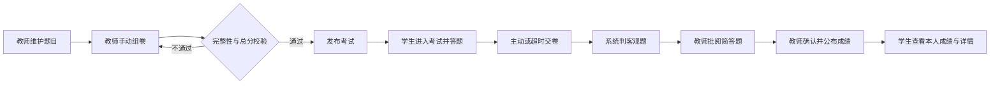

# 9 月 1 日需求分析

## 1. 分析结论

本项目选择“智能在线题库与组卷系统”，采用 Java Web 前后端分离架构。9 月 1 日冻结的是 MVP 的目标、角色、范围、核心流程、关键规则和验收口径；技术精确版本、页面原型、数据库表结构和 REST API 字段属于 9 月 2 日设计任务，尚未冻结。

MVP 必须打通以下闭环：

> 教师维护题库 → 创建并发布试卷 → 学生参加考试 → 系统判客观题 → 教师批阅主观题 → 公布并查看成绩

## 2. 用户与目标

| 角色 | 核心目标 | MVP 操作 |
|---|---|---|
| 管理员 | 保证演示账号可用 | 查看、新增、禁用用户 |
| 教师 | 完成从建题到公布成绩的教学流程 | 管理题目、组卷、发布考试、阅卷、查看统计 |
| 学生 | 完成考试并查看已公布成绩 | 查看考试、答题、交卷、查看自己的成绩与详情 |

管理员仅保留必要的用户管理能力，不建设复杂运营后台。MVP 不建设班级和选课模块，所有状态正常的学生均可参加开放时间内已发布的考试。

## 3. 功能需求

### 3.1 必须实现

| 模块 | 功能 | 可验收结果 |
|---|---|---|
| 认证与权限 | 登录、退出、三类角色鉴权、用户状态校验 | 未登录返回 401，越权返回 403，禁用账号不可正常使用 |
| 用户管理 | 管理员查看、新增、禁用用户 | 被禁用用户不能继续参与业务操作，历史数据保留 |
| 题库 | 维护单选、多选、判断、简答题及知识点 | 教师可增删改查，并按题型、难度、知识点筛选 |
| 试卷 | 手动选题、设置题序和分值、保存草稿、预览、发布 | 总分和题目完整性校验通过后才可发布 |
| 考试 | 设置开放时间与时长、学生答题、倒计时、主动或超时交卷 | 每名学生对同一考试只有一份有效答卷 |
| 评分 | 客观题自动判分、简答题教师评分、汇总总分 | 示例答卷客观分 20 分、主观分 8 分、总分 28 分 |
| 成绩 | 教师查看成绩与基础统计，确认公布后学生查分 | 公布前学生看不到临时总分，且只能查看本人数据 |

### 3.2 延后或排除

规则自动组卷、错题本、统计图表、批量导入导出、自动保存属于增强功能，只有 9 项核心验收用例全部通过后才考虑。在线监考、摄像头识别、大规模分布式部署、AI 出题或主观题评分、支付和第三方教务集成不在本次范围内。

## 4. 核心业务流程

### 4.1 关键状态与异常

- 考试按“草稿 → 已发布 → 进行中 → 已结束 → 已完成阅卷 → 已公布”流转。
- 开始前不可答题；截止后自动交卷且不可继续修改。
- 已有答卷的考试不可撤回或删除，只能提前结束。
- 已发布试卷不可直接修改；需要调整时撤回未作答考试或复制试卷。
- 被引用题目和存在答卷的用户不物理删除，只能停用，以保留历史可追溯性。
- 交卷须使用事务，并以“考试 ID + 学生 ID”唯一约束阻止并发重复提交。
- 单选和判断完全正确得满分；多选答案集合完全一致才得满分；未答或错误得 0 分；分值保留一位小数。

## 5. 核心用例与验收数据

验收数据固定为：管理员、教师、学生甲、学生乙各一个正常账号；四种题型各一题，每题 10 分；试卷总分 40 分、时长 30 分。学生甲单选正确、多选少选、判断正确，简答题由教师评 8 分。

核心用例共 9 项：题库维护与筛选、正确组卷并发布、学生答题交卷、客观题计分及防重复提交、主观题评分与成绩公布、学生数据隔离、教师成绩统计、401/403/400 异常路径、截止时间自动交卷。详细步骤和预期结果以 [`plan.md`](../plan.md#72-核心验收用例) 为准。

## 6. 竞品参考

以下仅记录从官方页面可复核的产品能力及本项目取舍，不把竞品宣传数据作为本项目性能依据。页面核对时间为 2026-09-01。

| 产品 | 官方资料显示的相关能力 | 本项目借鉴 | MVP 不照搬的部分 |
|---|---|---|---|
| Moodle Quiz | 题目独立存放在题库，可分类、筛选、复用到测验；测验支持预览、提交、成绩及教师查看作答 | 题库与试卷分离、知识点筛选、发布前预览、历史题目保留 | 跨课程共享、复杂题型与插件体系 |
| Canvas New Quizzes | 可从 Item Banks 向测验添加单题或多题，并在测验中设置题目分值 | 从题库手动选题组卷，试卷题目拥有独立实际分值 | LMS 课程体系、机构级题库共享、QTI 导入 |
| Google Forms Quiz | 可配置答案与分值、自动评分部分题型、逐份或逐题人工评分，并选择立即或人工复核后发布成绩 | 客观题自动判分、主观题人工评分、成绩确认后公布 | 通用表单、邮件发分及表格生态集成 |

官方资料：

- [Moodle Question banks](https://docs.moodle.org/500/en/Question_banks)
- [Moodle Quiz activity](https://docs.moodle.org/401/en/Quiz_activity)
- [Canvas：从题库向 New Quizzes 添加题目](https://community.canvaslms.com/t5/%E6%8C%87%E5%8D%97%E4%B8%AD%E6%96%87%E7%89%88-%E8%AE%B2%E5%B8%88%E6%8C%87%E5%8D%97-instructor/%E6%88%91%E8%AF%A5%E5%A6%82%E4%BD%95%E5%9C%A8%E6%96%B0%E6%B5%8B%E9%AA%8C%E4%B8%AD%E5%B0%86%E9%A2%98%E5%BA%93%E4%B8%AD%E7%9A%84%E9%A2%98%E7%9B%AE%E6%B7%BB%E5%8A%A0%E5%88%B0%E6%B5%8B%E9%AA%8C%E4%B8%AD/ta-p/571537)
- [Google Forms：创建和批改测验](https://support.google.com/docs/answer/7032287?hl=zh-Hans)

课程报告要求竞品部分最终包含 2—3 款产品截图。当前阶段已确定参考页面和借鉴点，但截图应在撰写最终报告时从上述官方页面实际采集，并注明采集日期，不以占位图冒充。

## 7. 协作与完成标准

两名成员不固定前端或后端主责，按当天时间、兴趣、熟悉程度和依赖动态认领，也可结对完成。每项进行中任务必须记录当次负责人、另一名复核人和完成证据；无人认领或阻塞超过半天时立即协商接手。

9 月 1 日完成标准：

- 项目选题、角色和 MVP 边界明确；
- 需求列表、主流程、异常规则和验收数据可供后续设计；
- 至少 2 款竞品的官方资料、借鉴点和范围取舍可复核；
- 动态认领规则已写入计划；
- 未把 9 月 2 日的技术版本、原型、数据库和 API 设计误记为已完成。

## 8. 待后续设计验证

- 9 月 2 日固定 Java、Spring Boot、Node.js、Vue 和 MySQL 的精确版本及兼容关系。
- 用页面原型验证教师组卷和学生答题流程是否足够简洁。
- 用数据库 ER 设计验证历史试卷、题目和答卷的追溯方式。
- 用 REST API 清单验证前后端字段、错误码和状态流转约定。
