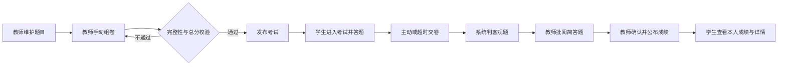

# 需求分析

## 1. 分析结论

本项目采用 Java Web 前后端分离架构，目标是完成可运行、可验收的在线题库与考试闭环。

MVP 必须打通以下闭环：

> 教师维护题库 → 创建并发布试卷 → 学生参加考试 → 系统判客观题 → 教师批阅主观题 → 公布并查看成绩

## 2. 用户与目标

| 角色 | 核心目标 | MVP 操作 |
|---|---|---|
| 管理员 | 保证演示账号可用 | 查看、新增、禁用用户 |
| 教师 | 完成从建题到公布成绩的教学流程 | 管理题目、组卷、发布考试、阅卷、查看统计 |
| 学生 | 完成考试并查看已公布成绩 | 查看考试、答题、交卷、查看自己的成绩与详情 |

管理员仅保留必要的用户管理能力，不建设复杂运营后台。MVP 不建设班级和选课模块，所有状态正常的学生均可参加开放时间内已发布的考试。

## 3. 功能需求

### 3.1 必须实现

| 模块 | 功能 | 可验收结果 |
|---|---|---|
| 认证与权限 | 登录、退出、三类角色鉴权、用户状态校验 | 未登录返回 401，越权返回 403，禁用账号不可正常使用 |
| 用户管理 | 管理员查看、新增、禁用用户 | 被禁用用户不能继续参与业务操作，历史数据保留 |
| 题库 | 维护单选、多选、判断、简答、编程五类题目及知识点 | 教师可增删改查，并按题型、难度、知识点、状态和关键词筛选 |
| 试卷 | 手动选题、设置题序和分值、保存草稿、预览、发布 | 总分和题目完整性校验通过后才可发布 |
| 考试 | 设置开放时间与时长、学生答题、倒计时、主动或超时交卷 | 每名学生对同一考试只有一份有效答卷 |
| 评分 | 客观题自动判分、简答题教师评分、汇总总分 | 示例答卷客观分 20 分、主观分 8 分、总分 28 分 |
| 成绩 | 教师查看答卷、排名与统计，确认公布后学生查看本人答卷和名次 | 公布前不泄露成绩和答案，学生不能访问他人数据 |

### 3.2 延后或排除

AI 辅助出题是已确认增强功能，已实现：服务商可自定义，兼容 OpenAI 与 Anthropic 两种协议，只生成可编辑草稿，教师确认后才走普通的题目新增接口保存。规则自动组卷、错题本、图表和批量导入导出未进入验收范围；在线监考、分布式部署、AI 主观题评分、支付和第三方教务集成不实现。

## 4. 核心业务流程

### 4.1 关键状态与异常

- 考试按“草稿 → 已发布 → 进行中 → 已结束 → 已完成阅卷 → 已公布”流转。
- 开始前不可答题；截止后自动交卷且不可继续修改。
- 已有答卷的考试不可撤回或删除，只能提前结束。
- 已发布试卷不可直接修改；需要调整时撤回未作答考试或复制试卷。
- 被引用题目和存在答卷的用户不物理删除，只能停用，以保留历史可追溯性。
- 交卷须使用事务，并以“考试 ID + 学生 ID”唯一约束阻止并发重复提交。
- 单选和判断完全正确得满分；多选答案集合完全一致才得满分；未答或错误得 0 分；分值保留一位小数。

## 5. 核心用例与验收数据

验收数据固定为：管理员、教师、学生甲、学生乙各一个正常账号；四种题型各一题，每题 10 分；试卷总分 40 分、时长 30 分。学生甲单选正确、多选少选、判断正确，简答题由教师评 8 分。

核心用例共 9 项：题库维护与筛选、正确组卷并发布、学生答题交卷、客观题计分及防重复提交、主观题评分与成绩公布、学生数据隔离、教师成绩统计、401/403/400 异常路径、截止时间自动交卷。详细步骤和预期结果以 [`plan.md`](../plan.md#72-核心验收用例) 为准，逐项执行结果见 [`test-records.md`](test-records.md#2-九项核心验收用例)。

## 6. 竞品参考

以下仅记录从官方页面可复核的产品能力及本项目取舍，不把竞品宣传数据作为本项目性能依据。页面核对时间为 2026-09-01。

| 产品 | 官方资料显示的相关能力 | 本项目借鉴 | MVP 不照搬的部分 |
|---|---|---|---|
| Moodle Quiz | 题目独立存放在题库，可分类、筛选、复用到测验；测验支持预览、提交、成绩及教师查看作答 | 题库与试卷分离、知识点筛选、发布前预览、历史题目保留 | 跨课程共享、复杂题型与插件体系 |
| Canvas New Quizzes | 可从 Item Banks 向测验添加单题或多题，并在测验中设置题目分值 | 从题库手动选题组卷，试卷题目拥有独立实际分值 | LMS 课程体系、机构级题库共享、QTI 导入 |
| Google Forms Quiz | 可配置答案与分值、自动评分部分题型、逐份或逐题人工评分，并选择立即或人工复核后发布成绩 | 客观题自动判分、主观题人工评分、成绩确认后公布 | 通用表单、邮件发分及表格生态集成 |

官方资料：

- [Moodle Question banks](https://docs.moodle.org/500/en/Question_banks)
- [Moodle Quiz activity](https://docs.moodle.org/401/en/Quiz_activity)
- [Canvas：从题库向 New Quizzes 添加题目](https://community.canvaslms.com/t5/%E6%8C%87%E5%8D%97%E4%B8%AD%E6%96%87%E7%89%88-%E8%AE%B2%E5%B8%88%E6%8C%87%E5%8D%97-instructor/%E6%88%91%E8%AF%A5%E5%A6%82%E4%BD%95%E5%9C%A8%E6%96%B0%E6%B5%8B%E9%AA%8C%E4%B8%AD%E5%B0%86%E9%A2%98%E5%BA%93%E4%B8%AD%E7%9A%84%E9%A2%98%E7%9B%AE%E6%B7%BB%E5%8A%A0%E5%88%B0%E6%B5%8B%E9%AA%8C%E4%B8%AD/ta-p/571537)
- [Google Forms：创建和批改测验](https://support.google.com/docs/answer/7032287?hl=zh-Hans)

课程报告使用竞品截图时，应从官方页面采集并注明日期。

## 7. 执行与完成标准

项目实际由一人完成，后端、前端、数据库、测试和文档按依赖串行推进。每项任务必须记录自动化输出、接口响应、截图或干净环境复现证据，以多层可复核证据替代不存在的第二名人工复核。

功能完成必须同时具备实现、正常与异常测试、权限校验、页面联调和对应文档；详细完成定义以 [`plan.md`](../plan.md#73-完成定义) 为准。
