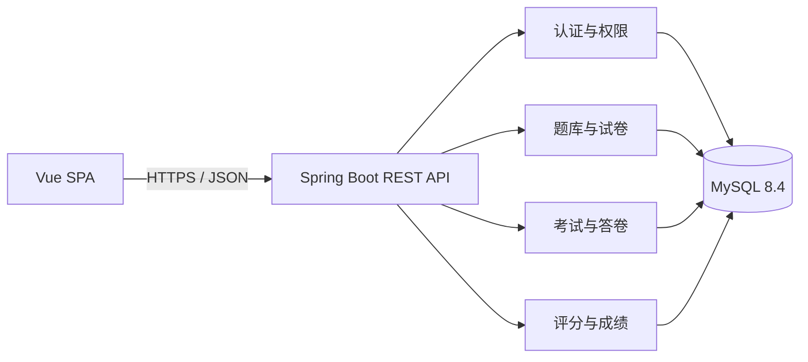

# 技术方案与工程约定

## 1. 版本基线

| 组件 | 项目基线 |
|---|---:|
| Java | 21 |
| Spring Boot | 3.5.16 |
| Maven | 3.9+ |
| Node.js | 24 LTS；实际兼容范围以 `frontend/package.json` 的 `engines` 为准 |
| Vue | 3.5.x |
| Vite | 8.x |
| TypeScript | 6.x |
| MySQL | 8.4 LTS |

精确依赖以 `backend/pom.xml` 和 `frontend/package-lock.json` 为准。升级依赖必须先通过后端测试及前端类型检查、Lint、单元测试和生产构建。

## 2. 总体结构

```text
smart-exam-platform/
├── backend/                    Spring Boot REST API
│   ├── src/main/java/          业务源码
│   ├── src/main/resources/     配置与 Flyway 迁移
│   └── src/test/               后端测试
├── frontend/                   Vue 单页应用与接口客户端
├── docs/                       需求、原型、数据库和 API 文档
├── database/                   本机 MySQL 初始化入口
├── compose.yaml                可选的 MySQL 容器入口
└── .env.example               无敏感信息的配置示例
```

后端按 `auth`、`user`、`question`、`exam`、`system`、`common` 业务模块组织；模块内包含接口、服务、持久化和模型。

## 3. 运行与配置策略

- 默认使用本机 MySQL 8.4，不要求安装 Docker。首次运行以管理员身份执行 `mysql -uroot -p < database/bootstrap-local.sql` 创建开发库和受限账号。
- `docker compose up -d db` 只是已安装 Docker 时的可选替代路径；容器数据写入命名卷，不提交仓库。
- 后端从环境变量读取数据库地址、账号、密码和 `JWT_SECRET`；JWT 密钥至少 32 字节且没有可提交的运行默认值。
- 前端只读取以 `VITE_` 开头的公开构建变量，不得写入数据库密码或 JWT 密钥。
- `.env`、`application-local.*` 和其他本地配置被 Git 忽略；可提交的示例统一写在 `.env.example`。
- 浏览器只访问 `/api`；开发服务器把 `/api` 代理到后端，生产环境由同源反向代理转发。

## 4. 架构边界



- Controller 只处理 HTTP 映射、输入校验和响应转换。
- Service 承担权限后的业务规则和事务边界，交卷与计分必须在事务中完成。
- Repository 只负责持久化访问；数据库唯一约束是防重复提交的最终保障。
- API 不直接暴露数据库实体，使用请求/响应 DTO，避免历史字段变化破坏契约。

## 5. 已确定边界

已确定：版本基线、目录、配置来源、模块边界、REST/JSON、MySQL/Flyway、Vue SPA。

认证使用 Spring Security Resource Server、Nimbus JOSE 和 HS256，访问令牌默认有效期 60 分钟。数据访问使用 Spring JDBC。生产域名与 HTTPS 终止方式尚未确定。
