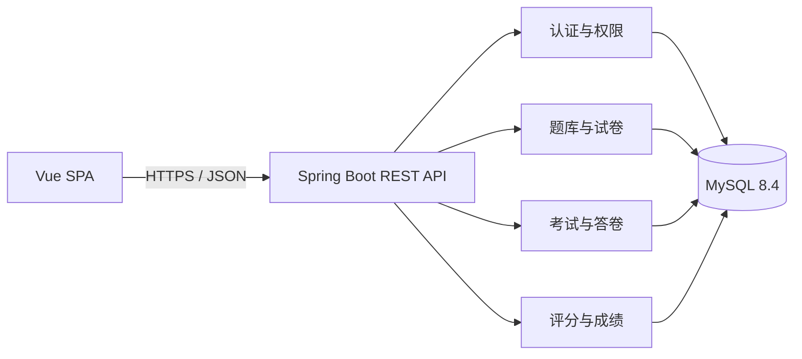

# 技术方案与工程约定

## 1. 版本基线

| 组件 | 项目基线 |
|---|---:|
| Java | 21 |
| Spring Boot | 3.5.16 |
| Maven | 3.9+ |
| Node.js | 24 LTS；实际兼容范围以 `frontend/package.json` 的 `engines` 为准 |
| Vue | 3.5.x |
| Vite | 8.x |
| TypeScript | 6.x |
| MySQL | 8.4 LTS |

精确依赖以 `backend/pom.xml` 和 `frontend/package-lock.json` 为准。升级依赖必须先通过后端测试及前端类型检查、Lint、单元测试和生产构建。

## 2. 总体结构

```text
smart-exam-platform/
├── backend/                    Spring Boot REST API
│   ├── src/main/java/          业务源码
│   ├── src/main/resources/     配置与 Flyway 迁移
│   └── src/test/               后端测试
├── frontend/                   Vue 单页应用与接口客户端
├── docs/                       需求、原型、数据库和 API 文档
├── database/                   本机 MySQL 初始化入口
├── compose.yaml                可选的 MySQL 容器入口
└── .env.example               无敏感信息的配置示例
```

后端按 `auth`、`user`、`question`、`exam`、`practice`、`ai`、`stats`、`system`、`common` 业务模块组织；模块内包含接口、服务、持久化和模型。

`ai` 模块只依赖 `question` 的校验入口，不直连数据库：它把模型输出组装成题目请求后交给 `QuestionService` 校验，保存仍走题目新增接口。协议适配（OpenAI 兼容 / Anthropic Messages）与 HTTP 超时配置分成 `RestAiClient` 和 `AiHttpConfig` 两处，前者只管「拼请求、取文本」，后者只管连接参数，测试可以替换其中任意一层。

`stats` 模块同样是只读的上层模块：单场考试的平均分、最高分、及格率和排名直接调用 `GradingService#results`，因此「谁能看这场考试」的归属校验和成绩口径都只有一处实现，成绩管理页与统计分析页不可能出现两套数字。它自己只负责两件独有的事——把已评完的总分分桶成分布，把逐题作答聚合成正确率；聚合放在 Java 而不是 SQL，原因是「是否留空」要判断 JSON 内容，MySQL 与 H2 的 JSON 函数不通用。

`practice` 模块（错题本与错题重练）也是只读上层模块 + 一张独立表：错题的定义（本人、已公布成绩、未得满分）只在 `PracticeRepository` 里写一次，三个查询共用；判分复用从 `ExamService` 抽出的 `ObjectiveGrader`，与交卷判分是同一份实现，避免出现「考试判错、重练判对」。练习记录写在独立的 `practice_attempt` 表，**不碰 `submission` 与 `submission_answer` 的任何字段**——已公布的成绩不能被学生自己的练习改写。

试卷相关的两个上层能力同样不新增写入路径：`PaperAutoComposeService`（规则自动组卷）只读题库并返回方案，保存仍走 `ExamService#createPaper`；`PaperExportService`（试卷导出）只读试卷快照并生成文本，其中 CSV 的列名与题库导入模板逐字一致，因此导出的文件可以原样回导。加上 AI 草稿与批量导入，题库和试卷各自都只有一条写入路径。

`system` 模块除健康检查外提供系统设置：返回当前进程真正生效的运行参数，用于现场核对环境；其中白名单内的六项允许管理员修改（写接口限管理员，教师只读），响应不含任何密钥、密码或连接串。

设置的读写实现放在 `common.SettingsStore` 与 `common.SettingsCatalog` 而不是 `system` 模块里：及格线、导入上限这些参数的**使用方**分散在 `exam`、`question`、`practice`、`auth` 四个模块，把存取放进 `common`（与 `DomainException`、`PageResult` 同级的横切设施）可以让各业务模块只依赖 `common`，不必反向依赖 `system`。模型是「环境变量是默认值，`system_setting` 表是覆盖层」，读取路径就是生效路径，因此界面上不会出现「改完不生效」。

## 3. 运行与配置策略

- 默认使用本机 MySQL 8.4，不要求安装 Docker。首次运行以管理员身份执行 `mysql -uroot -p < database/bootstrap-local.sql` 创建开发库和受限账号。
- `docker compose up -d db` 只是已安装 Docker 时的可选替代路径；容器数据写入命名卷，不提交仓库。
- 后端从环境变量读取数据库地址、账号、密码和 `JWT_SECRET`；JWT 密钥至少 32 字节且没有可提交的运行默认值。
- 前端只读取以 `VITE_` 开头的公开构建变量，不得写入数据库密码或 JWT 密钥。
- `.env`、`application-local.*` 和其他本地配置被 Git 忽略；可提交的示例统一写在 `.env.example`。
- 浏览器只访问 `/api`；开发服务器把 `/api` 代理到后端，生产环境由同源反向代理转发。

## 4. 架构边界



- Controller 只处理 HTTP 映射、输入校验和响应转换。
- Service 承担权限后的业务规则和事务边界，交卷与计分必须在事务中完成。
- Repository 只负责持久化访问；数据库唯一约束是防重复提交的最终保障。
- API 不直接暴露数据库实体，使用请求/响应 DTO，避免历史字段变化破坏契约。

## 5. 已确定边界

已确定：版本基线、目录、配置来源、模块边界、REST/JSON、MySQL/Flyway、Vue SPA。

认证使用 Spring Security Resource Server、Nimbus JOSE 和 HS256，访问令牌默认有效期 60 分钟。数据访问使用 Spring JDBC。部署形态限定为单实例本机运行（另提供可选的 Compose 数据库），生产域名与 HTTPS 终止不在本期范围内。
